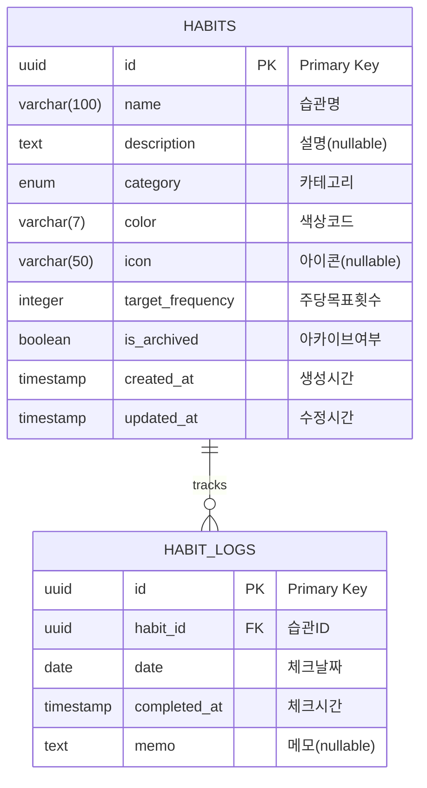
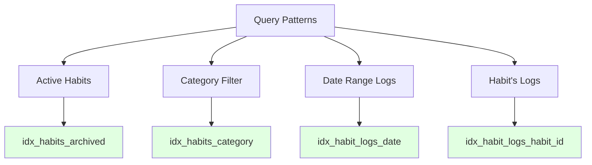
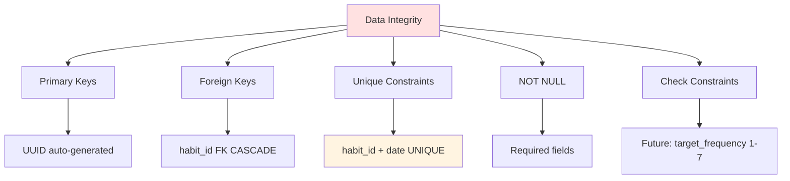

# Habit Tracker - Database Documentation

## 1. Overview

### 1.1 Database System
- **DBMS**: PostgreSQL 16+
- **ORM**: Drizzle ORM
- **Connection**: Docker container (existing)
- **Migration Tool**: Drizzle Kit

### 1.2 Design Principles
- **Normalization**: 3NF (Third Normal Form)
- **Referential Integrity**: Foreign keys with CASCADE
- **Data Integrity**: Unique constraints, NOT NULL
- **Performance**: Strategic indexes on query patterns
- **Audit**: created_at, updated_at timestamps

---

## 2. Entity Relationship Diagram (ERD)



### 2.1 Relationship Details

| Relationship | Type | Cardinality | Cascade |
|--------------|------|-------------|---------|
| HABITS → HABIT_LOGS | One-to-Many | 1:N | ON DELETE CASCADE |

**Cascade Behavior**:
- 습관 삭제 시 → 모든 관련 로그 자동 삭제
- 데이터 일관성 보장
- Archive 기능으로 실제 삭제는 최소화

---

## 3. Schema Design

### 3.1 Table: `habits`

```sql
CREATE TYPE category AS ENUM ('health', 'learning', 'exercise', 'other');

CREATE TABLE habits (
    id                  UUID PRIMARY KEY DEFAULT gen_random_uuid(),
    name                VARCHAR(100) NOT NULL,
    description         TEXT,
    category            category NOT NULL DEFAULT 'other',
    color               VARCHAR(7) NOT NULL DEFAULT '#3B82F6',
    icon                VARCHAR(50),
    target_frequency    INTEGER NOT NULL DEFAULT 7,
    is_archived         BOOLEAN DEFAULT FALSE,
    created_at          TIMESTAMP WITH TIME ZONE DEFAULT CURRENT_TIMESTAMP,
    updated_at          TIMESTAMP WITH TIME ZONE DEFAULT CURRENT_TIMESTAMP
);

-- Indexes
CREATE INDEX idx_habits_archived ON habits(is_archived);
CREATE INDEX idx_habits_category ON habits(category);
CREATE INDEX idx_habits_created_at ON habits(created_at DESC);

-- Update trigger for updated_at
CREATE OR REPLACE FUNCTION update_updated_at_column()
RETURNS TRIGGER AS $$
BEGIN
    NEW.updated_at = CURRENT_TIMESTAMP;
    RETURN NEW;
END;
$$ LANGUAGE plpgsql;

CREATE TRIGGER update_habits_updated_at
    BEFORE UPDATE ON habits
    FOR EACH ROW
    EXECUTE FUNCTION update_updated_at_column();
```

#### 3.1.1 Column Specifications

| Column | Type | Constraints | Default | Description |
|--------|------|-------------|---------|-------------|
| `id` | UUID | PRIMARY KEY | gen_random_uuid() | 고유 식별자 |
| `name` | VARCHAR(100) | NOT NULL | - | 습관명 (예: "물 2L 마시기") |
| `description` | TEXT | NULLABLE | NULL | 상세 설명 |
| `category` | ENUM | NOT NULL | 'other' | health/learning/exercise/other |
| `color` | VARCHAR(7) | NOT NULL | '#3B82F6' | HEX 색상코드 (#RRGGBB) |
| `icon` | VARCHAR(50) | NULLABLE | NULL | 이모지 또는 아이콘명 |
| `target_frequency` | INTEGER | NOT NULL | 7 | 주당 목표 횟수 (7 = 매일) |
| `is_archived` | BOOLEAN | NOT NULL | FALSE | 아카이브 여부 (soft delete) |
| `created_at` | TIMESTAMP | NOT NULL | NOW() | 생성 시간 (UTC) |
| `updated_at` | TIMESTAMP | NOT NULL | NOW() | 수정 시간 (UTC, auto-update) |

#### 3.1.2 Business Rules
- `target_frequency`: 1~7 사이 값 (주당 1회 ~ 매일)
- `color`: 반드시 유효한 HEX 색상 (#RRGGBB)
- `is_archived = false`: 활성 습관만 기본 조회
- `category`: 고정된 4개 카테고리만 허용

---

### 3.2 Table: `habit_logs`

```sql
CREATE TABLE habit_logs (
    id              UUID PRIMARY KEY DEFAULT gen_random_uuid(),
    habit_id        UUID NOT NULL REFERENCES habits(id) ON DELETE CASCADE,
    date            DATE NOT NULL,
    completed_at    TIMESTAMP WITH TIME ZONE DEFAULT CURRENT_TIMESTAMP,
    memo            TEXT,

    -- Unique constraint: 같은 습관의 같은 날짜 중복 방지
    CONSTRAINT unique_habit_date UNIQUE (habit_id, date)
);

-- Indexes
CREATE INDEX idx_habit_logs_habit_id ON habit_logs(habit_id);
CREATE INDEX idx_habit_logs_date ON habit_logs(date DESC);
CREATE INDEX idx_habit_logs_completed_at ON habit_logs(completed_at DESC);
```

#### 3.2.1 Column Specifications

| Column | Type | Constraints | Default | Description |
|--------|------|-------------|---------|-------------|
| `id` | UUID | PRIMARY KEY | gen_random_uuid() | 고유 식별자 |
| `habit_id` | UUID | FK, NOT NULL | - | 습관 참조 (CASCADE DELETE) |
| `date` | DATE | NOT NULL | - | 체크한 날짜 (YYYY-MM-DD) |
| `completed_at` | TIMESTAMP | NOT NULL | NOW() | 체크한 시간 (UTC) |
| `memo` | TEXT | NULLABLE | NULL | 간단한 메모 |

#### 3.2.2 Constraints

**UNIQUE Constraint**:
```sql
CONSTRAINT unique_habit_date UNIQUE (habit_id, date)
```
- **Purpose**: 같은 습관을 같은 날짜에 중복 체크 방지
- **Behavior**: INSERT 시 위반 시 에러 발생
- **Example**:
  ```sql
  -- OK: 다른 날짜
  INSERT INTO habit_logs (habit_id, date) VALUES ('uuid1', '2025-01-13');
  INSERT INTO habit_logs (habit_id, date) VALUES ('uuid1', '2025-01-14');

  -- ERROR: 같은 습관, 같은 날짜
  INSERT INTO habit_logs (habit_id, date) VALUES ('uuid1', '2025-01-13');
  -- ERROR: duplicate key value violates unique constraint "unique_habit_date"
  ```

**Foreign Key Constraint**:
```sql
habit_id UUID REFERENCES habits(id) ON DELETE CASCADE
```
- **ON DELETE CASCADE**: 습관 삭제 시 관련 로그 자동 삭제
- **Rationale**: 데이터 무결성 보장, orphan 레코드 방지

---

## 4. Drizzle ORM Schema

### 4.1 Schema Definition (`src/lib/db/schema.ts`)

```typescript
import { pgTable, uuid, varchar, text, integer, boolean, timestamp, date, pgEnum, unique } from 'drizzle-orm/pg-core'

// Enum definition
export const categoryEnum = pgEnum('category', ['health', 'learning', 'exercise', 'other'])

// habits table
export const habits = pgTable('habits', {
  id: uuid('id').primaryKey().defaultRandom(),
  name: varchar('name', { length: 100 }).notNull(),
  description: text('description'),
  category: categoryEnum('category').notNull().default('other'),
  color: varchar('color', { length: 7 }).notNull().default('#3B82F6'),
  icon: varchar('icon', { length: 50 }),
  targetFrequency: integer('target_frequency').notNull().default(7),
  isArchived: boolean('is_archived').default(false).notNull(),
  createdAt: timestamp('created_at', { withTimezone: true }).defaultNow().notNull(),
  updatedAt: timestamp('updated_at', { withTimezone: true }).defaultNow().notNull(),
})

// habit_logs table
export const habitLogs = pgTable('habit_logs', {
  id: uuid('id').primaryKey().defaultRandom(),
  habitId: uuid('habit_id').references(() => habits.id, { onDelete: 'cascade' }).notNull(),
  date: date('date').notNull(),
  completedAt: timestamp('completed_at', { withTimezone: true }).defaultNow().notNull(),
  memo: text('memo'),
}, (table) => ({
  // Unique constraint
  uniqueHabitDate: unique().on(table.habitId, table.date),
}))

// TypeScript types
export type Habit = typeof habits.$inferSelect
export type NewHabit = typeof habits.$inferInsert
export type HabitLog = typeof habitLogs.$inferSelect
export type NewHabitLog = typeof habitLogs.$inferInsert
```

---

## 5. Indexes Strategy

### 5.1 Index Overview

| Table | Index Name | Columns | Type | Purpose |
|-------|------------|---------|------|---------|
| habits | `idx_habits_archived` | is_archived | B-tree | Active habits 필터링 |
| habits | `idx_habits_category` | category | B-tree | 카테고리별 필터링 |
| habits | `idx_habits_created_at` | created_at DESC | B-tree | 최신순 정렬 |
| habits | `idx_habits_active_created` | created_at DESC (partial) | B-tree | Active habits 최적화 |
| habit_logs | `idx_habit_logs_habit_id` | habit_id | B-tree | FK JOIN 최적화 |
| habit_logs | `idx_habit_logs_date` | date DESC | B-tree | 날짜 범위 검색 |
| habit_logs | `idx_habit_logs_habit_date` | (habit_id, date DESC) | B-tree | Streak 계산 최적화 |
| habit_logs | `idx_habit_logs_recent` | (habit_id, date DESC) (partial) | B-tree | 최근 6개월 로그 |

**Advanced Indexes (Performance Critical)**:
```sql
-- Partial index: Active habits only (90% of queries)
CREATE INDEX idx_habits_active_created ON habits(created_at DESC)
WHERE is_archived = false;

-- Composite index: Streak calculation (habit + date range)
CREATE INDEX idx_habit_logs_habit_date ON habit_logs(habit_id, date DESC);

-- Partial index: Recent logs only (6 months)
CREATE INDEX idx_habit_logs_recent ON habit_logs(habit_id, date DESC)
WHERE date >= CURRENT_DATE - INTERVAL '6 months';
```

### 5.2 Query Pattern → Index Mapping



### 5.3 Index Performance Impact

**Before Index**:
```sql
EXPLAIN SELECT * FROM habits WHERE is_archived = false;
-- Seq Scan on habits (cost=0.00..35.50 rows=1000 width=...)
```

**After Index**:
```sql
EXPLAIN SELECT * FROM habits WHERE is_archived = false;
-- Index Scan using idx_habits_archived (cost=0.15..8.17 rows=1000 width=...)
```

**Performance Gain**: ~4x faster for filtered queries

---

## 6. Query Patterns

### 6.1 Habit CRUD Operations

#### 6.1.1 Create Habit
```sql
INSERT INTO habits (name, category, color, target_frequency)
VALUES ('물 2L 마시기', 'health', '#3B82F6', 7)
RETURNING *;
```

```typescript
// Drizzle
const newHabit = await db.insert(habits).values({
  name: '물 2L 마시기',
  category: 'health',
  color: '#3B82F6',
  targetFrequency: 7,
}).returning()
```

#### 6.1.2 Get Active Habits
```sql
SELECT * FROM habits
WHERE is_archived = false
ORDER BY created_at DESC;
```

```typescript
// Drizzle
const activeHabits = await db
  .select()
  .from(habits)
  .where(eq(habits.isArchived, false))
  .orderBy(desc(habits.createdAt))
```

#### 6.1.3 Update Habit
```sql
UPDATE habits
SET name = '물 3L 마시기',
    target_frequency = 6,
    updated_at = CURRENT_TIMESTAMP
WHERE id = 'uuid-here'
RETURNING *;
```

```typescript
// Drizzle
await db
  .update(habits)
  .set({ name: '물 3L 마시기', targetFrequency: 6 })
  .where(eq(habits.id, habitId))
```

#### 6.1.4 Archive Habit (Soft Delete)
```sql
UPDATE habits
SET is_archived = true,
    updated_at = CURRENT_TIMESTAMP
WHERE id = 'uuid-here';
```

```typescript
// Drizzle
await db
  .update(habits)
  .set({ isArchived: true })
  .where(eq(habits.id, habitId))
```

#### 6.1.5 Delete Habit (Hard Delete)
```sql
-- CASCADE로 habit_logs도 함께 삭제됨
DELETE FROM habits WHERE id = 'uuid-here';
```

---

### 6.2 Habit Log Operations

#### 6.2.1 Check Habit (Create Log)
```sql
INSERT INTO habit_logs (habit_id, date, memo)
VALUES ('uuid-here', '2025-01-13', '오늘은 쉬웠다')
RETURNING *;
```

```typescript
// Drizzle with duplicate handling
try {
  const log = await db.insert(habitLogs).values({
    habitId,
    date: '2025-01-13',
    memo: '오늘은 쉬웠다',
  }).returning()
} catch (error) {
  if (error.code === '23505') { // Unique constraint violation
    throw new Error('이미 오늘 체크했습니다')
  }
}
```

#### 6.2.2 Uncheck Habit (Delete Log)
```sql
DELETE FROM habit_logs
WHERE habit_id = 'uuid-here' AND date = '2025-01-13';
```

```typescript
// Drizzle
await db
  .delete(habitLogs)
  .where(and(
    eq(habitLogs.habitId, habitId),
    eq(habitLogs.date, '2025-01-13')
  ))
```

#### 6.2.3 Get Habit Logs (for Streak)
```sql
SELECT date, completed_at
FROM habit_logs
WHERE habit_id = 'uuid-here'
ORDER BY date DESC;
```

```typescript
// Drizzle
const logs = await db
  .select({ date: habitLogs.date, completedAt: habitLogs.completedAt })
  .from(habitLogs)
  .where(eq(habitLogs.habitId, habitId))
  .orderBy(desc(habitLogs.date))
```

---

### 6.3 Statistics Queries

#### 6.3.1 Today's Habits with Check Status
```sql
SELECT
    h.*,
    hl.id IS NOT NULL as is_checked,
    hl.completed_at
FROM habits h
LEFT JOIN habit_logs hl
    ON h.id = hl.habit_id
    AND hl.date = CURRENT_DATE
WHERE h.is_archived = false
ORDER BY h.created_at;
```

```typescript
// Drizzle
const today = new Date().toISOString().split('T')[0]

const habitsWithStatus = await db
  .select({
    ...habits,
    isChecked: sql<boolean>`${habitLogs.id} IS NOT NULL`,
    completedAt: habitLogs.completedAt,
  })
  .from(habits)
  .leftJoin(habitLogs, and(
    eq(habits.id, habitLogs.habitId),
    eq(habitLogs.date, today)
  ))
  .where(eq(habits.isArchived, false))
```

#### 6.3.2 Completion Rate by Category
```sql
SELECT
    h.category,
    COUNT(DISTINCT h.id) as total_habits,
    COUNT(hl.id) as total_checks,
    ROUND(COUNT(hl.id)::NUMERIC / NULLIF(COUNT(DISTINCT h.id), 0) * 100, 2) as completion_rate
FROM habits h
LEFT JOIN habit_logs hl ON h.id = hl.habit_id
WHERE h.is_archived = false
  AND hl.date >= CURRENT_DATE - INTERVAL '7 days'
GROUP BY h.category
ORDER BY completion_rate DESC;
```

#### 6.3.3 Monthly Heatmap Data
```sql
SELECT
    date,
    COUNT(DISTINCT habit_id) as habits_completed,
    (SELECT COUNT(*) FROM habits WHERE is_archived = false) as total_habits,
    ROUND(
        COUNT(DISTINCT habit_id)::NUMERIC /
        NULLIF((SELECT COUNT(*) FROM habits WHERE is_archived = false), 0) * 100,
        2
    ) as completion_rate
FROM habit_logs
WHERE date >= DATE_TRUNC('month', CURRENT_DATE)
  AND date < DATE_TRUNC('month', CURRENT_DATE) + INTERVAL '1 month'
GROUP BY date
ORDER BY date;
```

#### 6.3.4 Weekly Report
```sql
-- 이번 주 가장 잘 지킨 습관
SELECT
    h.name,
    COUNT(hl.id) as checks_this_week,
    h.target_frequency,
    ROUND(COUNT(hl.id)::NUMERIC / h.target_frequency * 100, 2) as achievement_rate
FROM habits h
LEFT JOIN habit_logs hl
    ON h.id = hl.habit_id
    AND hl.date >= DATE_TRUNC('week', CURRENT_DATE)
WHERE h.is_archived = false
GROUP BY h.id, h.name, h.target_frequency
ORDER BY achievement_rate DESC
LIMIT 3;
```

---

### 6.4 Streak Calculation Query

#### 6.4.1 Get Consecutive Days
```sql
WITH RECURSIVE date_series AS (
    -- Start from yesterday
    SELECT CURRENT_DATE - 1 as check_date
    UNION ALL
    SELECT check_date - 1
    FROM date_series
    WHERE check_date > (SELECT MIN(date) FROM habit_logs WHERE habit_id = 'uuid-here')
)
SELECT COUNT(*) as current_streak
FROM date_series ds
WHERE EXISTS (
    SELECT 1
    FROM habit_logs hl
    WHERE hl.habit_id = 'uuid-here'
    AND hl.date = ds.check_date
)
AND NOT EXISTS (
    -- Stop at first missing day
    SELECT 1
    FROM date_series ds2
    WHERE ds2.check_date > ds.check_date
    AND ds2.check_date < CURRENT_DATE
    AND NOT EXISTS (
        SELECT 1
        FROM habit_logs hl2
        WHERE hl2.habit_id = 'uuid-here'
        AND hl2.date = ds2.check_date
    )
);
```

**Note**: Streak calculation은 일반적으로 애플리케이션 레이어에서 처리하는 것이 더 효율적입니다.

---

## 7. Data Integrity Rules

### 7.1 Constraint Summary



### 7.2 Validation Rules

#### Application-Level Validation
```typescript
// Habit validation
const habitSchema = z.object({
  name: z.string().min(1).max(100),
  description: z.string().max(500).optional(),
  category: z.enum(['health', 'learning', 'exercise', 'other']),
  color: z.string().regex(/^#[0-9A-F]{6}$/i),
  targetFrequency: z.number().int().min(1).max(7),
})

// Habit Log validation
const logSchema = z.object({
  habitId: z.string().uuid(),
  date: z.string().regex(/^\d{4}-\d{2}-\d{2}$/),
  memo: z.string().max(200).optional(),
})
```

#### Database-Level Constraints (CRITICAL)
```sql
-- MUST implement these constraints
ALTER TABLE habits
ADD CONSTRAINT check_target_frequency
CHECK (target_frequency >= 1 AND target_frequency <= 7);

ALTER TABLE habits
ADD CONSTRAINT check_color_format
CHECK (color ~ '^#[0-9A-Fa-f]{6}$');

ALTER TABLE habit_logs
ADD CONSTRAINT check_date_not_future
CHECK (date <= CURRENT_DATE);
```

**Rationale**:
- `check_target_frequency`: Prevents invalid weekly goals (must be 1-7)
- `check_color_format`: Ensures valid HEX color codes
- `check_date_not_future`: Prevents checking future dates at DB level (defense in depth)

---

## 8. Migration Strategy

### 8.1 Initial Migration

```sql
-- Migration: 0001_create_habits_table.sql
CREATE TYPE category AS ENUM ('health', 'learning', 'exercise', 'other');

CREATE TABLE habits (
    id UUID PRIMARY KEY DEFAULT gen_random_uuid(),
    name VARCHAR(100) NOT NULL,
    description TEXT,
    category category NOT NULL DEFAULT 'other',
    color VARCHAR(7) NOT NULL DEFAULT '#3B82F6',
    icon VARCHAR(50),
    target_frequency INTEGER NOT NULL DEFAULT 7,
    is_archived BOOLEAN DEFAULT FALSE,
    created_at TIMESTAMP WITH TIME ZONE DEFAULT CURRENT_TIMESTAMP,
    updated_at TIMESTAMP WITH TIME ZONE DEFAULT CURRENT_TIMESTAMP
);

CREATE INDEX idx_habits_archived ON habits(is_archived);
CREATE INDEX idx_habits_category ON habits(category);
```

```sql
-- Migration: 0002_create_habit_logs_table.sql
CREATE TABLE habit_logs (
    id UUID PRIMARY KEY DEFAULT gen_random_uuid(),
    habit_id UUID NOT NULL REFERENCES habits(id) ON DELETE CASCADE,
    date DATE NOT NULL,
    completed_at TIMESTAMP WITH TIME ZONE DEFAULT CURRENT_TIMESTAMP,
    memo TEXT,
    CONSTRAINT unique_habit_date UNIQUE (habit_id, date)
);

CREATE INDEX idx_habit_logs_habit_id ON habit_logs(habit_id);
CREATE INDEX idx_habit_logs_date ON habit_logs(date DESC);
```

### 8.2 Drizzle Migration Commands

```bash
# Generate migration
npm run db:generate

# Run migration
npm run db:migrate

# Drop migration (development only)
npm run db:drop

# Studio (GUI)
npm run db:studio
```

### 8.3 Migration Best Practices
1. **Never edit applied migrations** - Create new ones
2. **Test migrations locally first** - Always test before production
3. **Backup before production migrations** - Safety first
4. **Use transactions** - Atomic migrations (all or nothing)

---

## 9. Sample Data

### 9.1 Seed Data Script

```sql
-- Insert sample habits
INSERT INTO habits (name, description, category, color, target_frequency) VALUES
('물 2L 마시기', '하루에 물 2리터 마시기', 'health', '#3B82F6', 7),
('30분 독서', '매일 30분 이상 독서하기', 'learning', '#8B5CF6', 7),
('아침 운동', '아침 30분 운동', 'exercise', '#EF4444', 5),
('명상 10분', '아침 명상 10분', 'health', '#10B981', 7),
('영어 공부', '영어 단어 20개 암기', 'learning', '#F59E0B', 5);

-- Insert sample logs (last 7 days)
WITH habit_ids AS (
    SELECT id FROM habits WHERE name = '물 2L 마시기'
)
INSERT INTO habit_logs (habit_id, date)
SELECT id, CURRENT_DATE - generate_series(0, 6)
FROM habit_ids;
```

### 9.2 Test Data Generator (TypeScript)

```typescript
// src/lib/db/seed.ts
import { db } from './index'
import { habits, habitLogs } from './schema'

async function seed() {
  // Create habits
  const [habit1] = await db.insert(habits).values({
    name: '물 2L 마시기',
    category: 'health',
    color: '#3B82F6',
    targetFrequency: 7,
  }).returning()

  // Create logs for last 30 days
  const logs = Array.from({ length: 30 }, (_, i) => ({
    habitId: habit1.id,
    date: new Date(Date.now() - i * 24 * 60 * 60 * 1000)
      .toISOString()
      .split('T')[0],
  }))

  await db.insert(habitLogs).values(logs)
}
```

---

## 10. Performance Considerations

### 10.1 Query Optimization Checklist

- [x] Indexes on frequently queried columns
- [x] Foreign key indexes (habit_id)
- [x] Date range indexes
- [ ] Partial indexes (future: `WHERE is_archived = false`)
- [ ] Covering indexes (future: if needed)

### 10.2 Connection Pooling

```typescript
// src/lib/db/index.ts
import { drizzle } from 'drizzle-orm/postgres-js'
import postgres from 'postgres'

const connectionString = process.env.DATABASE_URL!

// Connection pool configuration
const client = postgres(connectionString, {
  max: 10,              // Max connections
  idle_timeout: 20,     // Close idle connections after 20s
  connect_timeout: 10,  // Connection timeout
})

export const db = drizzle(client)
```

### 10.3 Query Performance Tips

1. **Use EXPLAIN ANALYZE** for slow queries
2. **Limit result sets** with pagination
3. **Avoid N+1 queries** with proper JOINs (see below)
4. **Use prepared statements** (Drizzle default)
5. **Cache frequently accessed data** (future: Redis)
6. **Limit streak queries** to recent 30 days only

### 10.4 N+1 Query Prevention (CRITICAL)

**Problem**: Loading habits with streak in a loop
```typescript
// ❌ BAD: N+1 queries
const habits = await getActiveHabits() // 1 query
for (const habit of habits) {
  const logs = await getHabitLogs(habit.id) // N queries
  const streak = calculateStreak(logs)
}
// Total: 1 + N queries
```

**Solution**: Batch query + JavaScript grouping
```typescript
// ✅ GOOD: 2 queries total
const habits = await db
  .select()
  .from(habitsTable)
  .where(eq(habitsTable.isArchived, false))

const habitIds = habits.map(h => h.id)

// Fetch all logs in ONE query
const allLogs = await db
  .select()
  .from(habitLogs)
  .where(and(
    inArray(habitLogs.habitId, habitIds),
    gte(habitLogs.date, sql`CURRENT_DATE - INTERVAL '30 days'`)
  ))
  .orderBy(desc(habitLogs.date))

// Group in JavaScript (fast)
const logsByHabit = allLogs.reduce((acc, log) => {
  if (!acc[log.habitId]) acc[log.habitId] = []
  acc[log.habitId].push(log)
  return acc
}, {} as Record<string, HabitLog[]>)

// Calculate streaks
const habitsWithStreak = habits.map(habit => ({
  ...habit,
  streak: calculateStreak(logsByHabit[habit.id] || [], habit.targetFrequency)
}))
// Total: 2 queries (4x-10x faster)
```

**Performance Impact**:
- 10 habits: 11 queries → 2 queries (5.5x faster)
- 50 habits: 51 queries → 2 queries (25x faster)
- 100 habits: 101 queries → 2 queries (50x faster)

---

## 11. Backup & Recovery

### 11.1 Backup Strategy

```bash
# Daily backup
pg_dump -h localhost -U postgres habit_tracker > backup_$(date +%Y%m%d).sql

# Backup with compression
pg_dump -h localhost -U postgres habit_tracker | gzip > backup_$(date +%Y%m%d).sql.gz

# Backup specific tables
pg_dump -h localhost -U postgres -t habits -t habit_logs habit_tracker > backup_tables.sql
```

### 11.2 Restore

```bash
# Restore from backup
psql -h localhost -U postgres habit_tracker < backup_20250113.sql

# Restore from compressed backup
gunzip -c backup_20250113.sql.gz | psql -h localhost -U postgres habit_tracker
```

---

## 12. Timezone & Date Handling (CRITICAL)

### 12.1 Timezone Policy

**Decision**: Client-side date (user timezone)

**Rationale**:
- Accurate for users across different timezones
- Prevents server timezone mismatch issues
- User checks at 23:50 local time = today, not tomorrow

**Implementation**:
```typescript
// Client: Get today's date in user timezone
const today = new Date().toLocaleDateString('en-CA') // YYYY-MM-DD

// Send to server
await checkHabit(habitId, today, memo)

// Server: Use date as-is (no conversion)
await db.insert(habitLogs).values({ habitId, date: today })
```

**Edge Cases**:
```typescript
// User in Seoul (UTC+9), 23:50
const today = new Date().toLocaleDateString('en-CA') // "2025-01-13"

// User in New York (UTC-5), 09:50 (same moment)
const today = new Date().toLocaleDateString('en-CA') // "2025-01-13"

// Both get correct "today" for their timezone
```

### 12.2 Date Validation Rules

**Future Date**: Rejected (cannot check future)
```sql
ALTER TABLE habit_logs
ADD CONSTRAINT check_date_not_future
CHECK (date <= CURRENT_DATE);
```

**Past Date**: Max 7 days (prevent data manipulation)
```typescript
export function validateCheckDate(dateStr: string) {
  const checkDate = new Date(dateStr)
  const today = new Date()

  if (checkDate > today) {
    return { valid: false, error: '미래 날짜는 체크할 수 없습니다' }
  }

  const maxPastDays = 7
  const pastLimit = new Date(today)
  pastLimit.setDate(pastLimit.getDate() - maxPastDays)

  if (checkDate < pastLimit) {
    return { valid: false, error: '최근 7일 이내만 체크 가능합니다' }
  }

  return { valid: true }
}
```

---

## 13. Streak Calculation Policy (CRITICAL)

### 13.1 Policy Decision

**Daily Habits (targetFrequency = 7)**: Strict streak calculation
**Weekly Habits (targetFrequency < 7)**: Weekly goal achievement, NO streak

**Rationale**:
- Weekly habits (e.g., "주 5회 운동") don't fit strict daily streak model
- Missing one day shouldn't reset progress if weekly goal is still achievable
- Clearer UX: "이번 주 3/5 완료 (60%)" vs confusing streak behavior

### 13.2 Streak Calculation Algorithm (Daily Habits)

```typescript
// Only for targetFrequency = 7
function calculateStreak(logs: HabitLog[]): StreakInfo {
  if (logs.length === 0) {
    return { currentStreak: 0, longestStreak: 0, lastCompletedDate: null }
  }

  // Sort logs by date (newest first)
  const sortedLogs = [...logs].sort((a, b) =>
    new Date(b.date).getTime() - new Date(a.date).getTime()
  )

  const yesterday = getYesterdayDate()
  let currentStreak = 0
  let longestStreak = 0
  let tempStreak = 0

  // Start from yesterday (today not counted)
  const yesterdayTime = new Date(yesterday).getTime()
  let expectedDate = yesterdayTime

  for (const log of sortedLogs) {
    const logTime = new Date(log.date).getTime()

    if (logTime === expectedDate) {
      tempStreak++
      if (logTime === yesterdayTime) {
        currentStreak = tempStreak
      }
      longestStreak = Math.max(longestStreak, tempStreak)
      expectedDate -= 24 * 60 * 60 * 1000 // Previous day
    } else if (logTime < expectedDate) {
      // Gap detected → streak broken
      break
    }
  }

  return { currentStreak, longestStreak, lastCompletedDate: sortedLogs[0].date }
}
```

**Examples**:
```typescript
// Scenario 1: Perfect streak
logs = ['2025-01-13', '2025-01-12', '2025-01-11', '2025-01-10']
today = '2025-01-14'
→ currentStreak = 3 (yesterday까지만 카운트)

// Scenario 2: Missed yesterday
logs = ['2025-01-12', '2025-01-11', '2025-01-10']
today = '2025-01-14'
→ currentStreak = 0 (어제 빠짐)

// Scenario 3: Checked today, perfect yesterday
logs = ['2025-01-14', '2025-01-13', '2025-01-12']
today = '2025-01-14'
→ currentStreak = 2 (오늘은 카운트 안 함)
```

### 13.3 Weekly Goal Calculation (Weekly Habits)

```typescript
// For targetFrequency < 7
function calculateWeeklyGoal(logs: HabitLog[], targetFrequency: number): WeeklyGoal {
  const today = new Date()
  const weekStart = new Date(today)
  weekStart.setDate(today.getDate() - today.getDay()) // Sunday

  const thisWeekLogs = logs.filter(log => {
    const logDate = new Date(log.date)
    return logDate >= weekStart && logDate <= today
  })

  const thisWeekCompleted = thisWeekLogs.length
  const achievementRate = Math.round(
    (thisWeekCompleted / targetFrequency) * 100
  )

  return {
    targetFrequency,
    thisWeekCompleted,
    achievementRate
  }
}
```

**Examples**:
```typescript
// Weekly habit: 주 5회 운동
targetFrequency = 5
logs = ['Mon', 'Tue', 'Thu', 'Sat'] // 이번 주 4회
→ { targetFrequency: 5, thisWeekCompleted: 4, achievementRate: 80 }

// Display: "이번 주 4/5 (80%)"
```

---

## 14. Security Considerations

### 12.1 SQL Injection Prevention
- ✅ Use Drizzle ORM (parameterized queries)
- ✅ Never concatenate user input in SQL
- ✅ Validate input at application layer

### 12.2 Access Control
```sql
-- Future: Create read-only user for analytics
CREATE USER analytics_user WITH PASSWORD 'secure_password';
GRANT CONNECT ON DATABASE habit_tracker TO analytics_user;
GRANT SELECT ON habits, habit_logs TO analytics_user;
```

### 12.3 Sensitive Data
- Passwords: N/A (no authentication yet)
- Personal data: None currently
- Future: Encrypt user data at rest

---

## Appendix A: Quick Reference

### A.1 Common Queries Cheat Sheet

```sql
-- Active habits count
SELECT COUNT(*) FROM habits WHERE is_archived = false;

-- Today's completion rate
SELECT
    COUNT(DISTINCT hl.habit_id)::FLOAT / COUNT(DISTINCT h.id) * 100 as rate
FROM habits h
LEFT JOIN habit_logs hl ON h.id = hl.habit_id AND hl.date = CURRENT_DATE
WHERE h.is_archived = false;

-- Longest streak (simplified)
SELECT COUNT(*) FROM habit_logs
WHERE habit_id = 'uuid'
AND date >= CURRENT_DATE - INTERVAL '30 days';

-- Category distribution
SELECT category, COUNT(*) FROM habits
WHERE is_archived = false
GROUP BY category;
```

---

## Appendix B: Troubleshooting

### B.1 Common Issues

**Issue**: Duplicate key error when checking habit
```
ERROR: duplicate key value violates unique constraint "unique_habit_date"
```
**Solution**: Check if log already exists before INSERT, or use `ON CONFLICT`

```sql
INSERT INTO habit_logs (habit_id, date)
VALUES ('uuid', '2025-01-13')
ON CONFLICT (habit_id, date) DO NOTHING;
```

**Issue**: Orphaned logs after habit deletion
**Solution**: Already handled by `ON DELETE CASCADE`

**Issue**: Slow queries on large datasets
**Solution**: Check indexes with `EXPLAIN ANALYZE`, add missing indexes

---

**Last Updated**: 2026-01-13
**Version**: 1.0
**Schema Version**: 0002 (2 tables)
**Author**: Database Team
