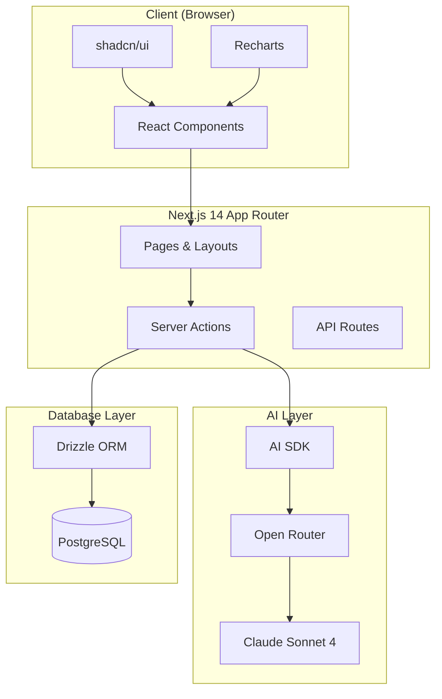
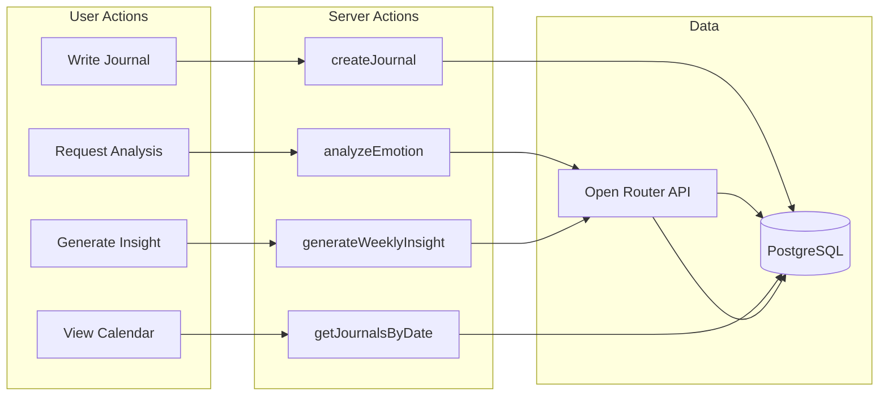
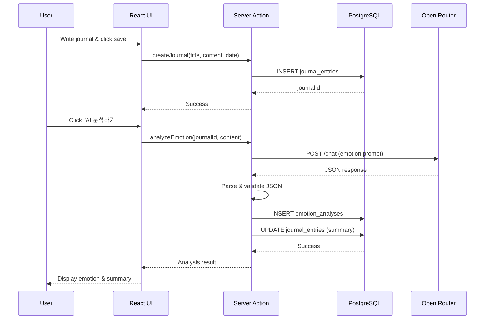
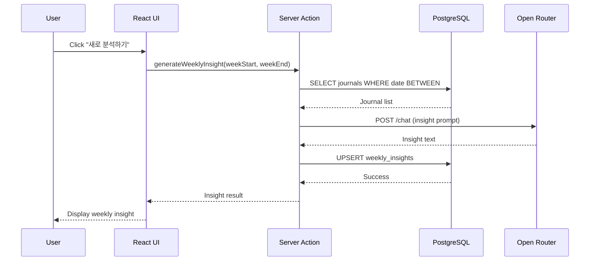
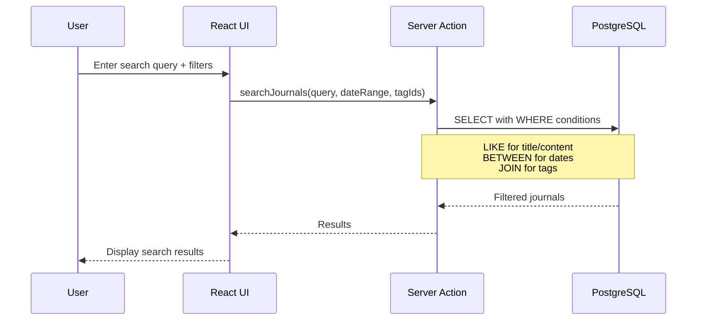
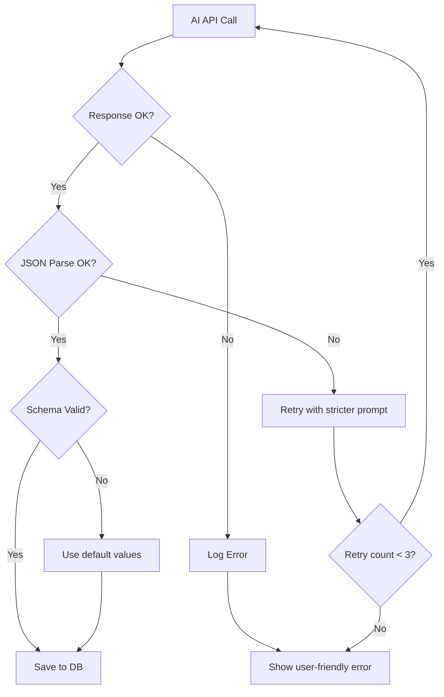

# AI Journal - Architecture Document

## 1. System Overview

### 1.1 Purpose & Scope
AI 기반 일기 앱으로, 사용자가 일기를 작성하면 AI가 감정을 분석하고 요약을 제공하며, 주간 단위로 인사이트를 생성하여 자기 성찰을 돕는 시스템.

### 1.2 Target Users
- 일기 쓰는 습관을 기르려는 사용자
- 감정 패턴을 파악하고 싶은 사용자
- AI 도움으로 자기 성찰을 원하는 사용자

### 1.3 Key Constraints
- Open Router API 키 필수 (외부 의존성)
- PostgreSQL 데이터베이스 필요 (Docker)
- AI 응답 JSON 파싱 안정성 필요
- 감정 점수 1-10 범위 제한

---

## 2. Architecture Diagram

### 2.1 System Architecture



### 2.2 Data Flow Architecture



---

## 3. Core Components

### 3.1 Journal Manager
| Item | Description |
|------|-------------|
| **Responsibility** | 일기 CRUD 및 날짜별 관리 |
| **Key Functions** | `createJournal`, `updateJournal`, `deleteJournal`, `getJournalByDate` |
| **Dependencies** | Drizzle ORM, PostgreSQL |

### 3.2 Emotion Analysis (AI)
| Item | Description |
|------|-------------|
| **Responsibility** | 일기 내용 기반 감정 분석 |
| **Key Functions** | `analyzeEmotion(content)` |
| **Output** | primaryEmotion, emotionScore(1-10), emotions object, keywords |
| **Dependencies** | AI SDK, Open Router, Claude Sonnet 4 |

### 3.3 Tag System
| Item | Description |
|------|-------------|
| **Responsibility** | 태그 생성/삭제, 일기-태그 연결 |
| **Key Functions** | `createTag`, `deleteTag`, `assignTag`, `removeTag` |
| **Dependencies** | Drizzle ORM (tags, journal_tags 테이블) |

### 3.4 Statistics Dashboard
| Item | Description |
|------|-------------|
| **Responsibility** | 감정 통계, 작성 패턴 시각화 |
| **Key Functions** | `getEmotionStats`, `getWritingStats`, `getTagStats` |
| **Dependencies** | Recharts, emotion_analyses 테이블 |

### 3.5 Calendar View
| Item | Description |
|------|-------------|
| **Responsibility** | 날짜별 일기 조회, 캘린더 네비게이션 |
| **Key Functions** | `getJournalsByMonth`, `getJournalByDate` |
| **Dependencies** | journal_entries 테이블 |

### 3.6 Weekly Insights (AI)
| Item | Description |
|------|-------------|
| **Responsibility** | 주간 일기 종합 분석 및 인사이트 제공 |
| **Key Functions** | `generateWeeklyInsight(journals)` |
| **Output** | 감정 패턴, 개선 제안, 긍정적인 점 |
| **Dependencies** | AI SDK, Open Router, weekly_insights 테이블 |

---

## 4. Data Flow

### 4.1 Journal Creation → AI Analysis Flow



### 4.2 Weekly Insight Generation Flow



### 4.3 Search and Filter Flow



---

## 5. Technology Stack Details

| Layer | Technology | Purpose |
|-------|------------|---------|
| **Framework** | Next.js 14 (App Router) | SSR, Server Actions, Routing |
| **Language** | TypeScript | Type safety |
| **Database** | PostgreSQL | Persistent storage |
| **ORM** | Drizzle ORM | Type-safe DB queries |
| **UI Library** | shadcn/ui | Accessible, customizable components |
| **Styling** | Tailwind CSS | Utility-first CSS |
| **Charts** | Recharts | Pie/Line charts for statistics |
| **AI SDK** | Vercel AI SDK | Streaming, structured output |
| **AI Provider** | Open Router | Claude Sonnet 4 access |
| **Container** | Docker | PostgreSQL hosting |

---

## 6. File Structure

```
app/
├── layout.tsx              # Root layout
├── page.tsx                # Main page (tabs: today, calendar, stats, insight)
├── globals.css             # Global styles
└── api/                    # API routes (if needed)

components/
├── journal/
│   ├── JournalEditor.tsx   # 일기 작성/수정 폼
│   ├── JournalCard.tsx     # 일기 카드 표시
│   └── JournalList.tsx     # 일기 목록
├── calendar/
│   ├── Calendar.tsx        # 캘린더 컴포넌트
│   └── DayCell.tsx         # 날짜 셀
├── stats/
│   ├── StatsDashboard.tsx  # 통계 대시보드
│   ├── EmotionPieChart.tsx # 감정 분포 차트
│   └── EmotionLineChart.tsx # 감정 추이 차트
├── insight/
│   └── WeeklyInsight.tsx   # 주간 인사이트
├── tags/
│   ├── TagManager.tsx      # 태그 관리
│   └── TagBadge.tsx        # 태그 뱃지
├── search/
│   └── SearchDialog.tsx    # 검색 다이얼로그
└── ui/                     # shadcn/ui components

db/
├── index.ts                # Drizzle client
├── schema.ts               # 테이블 스키마 정의
└── migrations/             # DB migrations

actions/
├── journal.ts              # Journal CRUD actions
├── tag.ts                  # Tag actions
├── emotion.ts              # Emotion analysis actions
├── insight.ts              # Weekly insight actions
└── stats.ts                # Statistics actions

lib/
├── ai/
│   ├── client.ts           # Open Router client setup
│   ├── prompts.ts          # Prompt templates
│   ├── analyze-emotion.ts  # Emotion analysis function
│   ├── summarize.ts        # Summary function
│   └── weekly-insight.ts   # Weekly insight function
└── utils.ts                # Utility functions
```

---

## 7. Key Design Decisions

### 7.1 Why Open Router?
| Reason | Description |
|--------|-------------|
| **Model Flexibility** | 다양한 AI 모델 선택 가능 (Claude, GPT 등) |
| **Cost Efficiency** | 사용량 기반 과금, 직접 API보다 저렴 |
| **Single API** | 하나의 API로 여러 모델 접근 |
| **Fallback** | 모델 장애 시 대체 모델 사용 가능 |

### 7.2 AI Prompt Strategy
| Aspect | Approach |
|--------|----------|
| **구조화된 출력** | JSON 형식 요청으로 파싱 안정성 확보 |
| **한글 지시** | 한국어 사용자 대상, 한글 프롬프트 |
| **역할 부여** | "감정 분석 전문가", "심리 상담 전문가" 등 |
| **명확한 형식** | 응답 형식을 JSON 스키마로 명시 |

### 7.3 Emotion Scoring Approach
| Design | Description |
|--------|-------------|
| **1-10 Scale** | 직관적인 10점 척도 |
| **6개 기본 감정** | happiness, sadness, anger, anxiety, calm, gratitude |
| **Primary Emotion** | 가장 높은 점수의 감정을 주요 감정으로 표시 |
| **Keywords** | 일기에서 추출한 핵심 키워드 3개 |

### 7.4 Chart Library Choice (Recharts)
| Reason | Description |
|--------|-------------|
| **React Native** | React 기반으로 통합 용이 |
| **Declarative** | 선언적 API로 간결한 코드 |
| **Customizable** | 스타일 커스터마이징 용이 |
| **Lightweight** | 필요한 차트만 import 가능 |

---

## 8. AI Integration Architecture

### 8.1 Open Router Setup

```typescript
// lib/ai/client.ts
import { createOpenRouter } from '@openrouter/ai-sdk-provider';

export const openrouter = createOpenRouter({
  apiKey: process.env.OPENROUTER_API_KEY,
});

export const model = openrouter('anthropic/claude-sonnet-4-20250514');
```

### 8.2 Model Selection
| Model | Use Case |
|-------|----------|
| `anthropic/claude-sonnet-4-20250514` | 감정 분석, 요약, 인사이트 생성 |

선택 이유:
- 한국어 이해도 높음
- 감정 분석에 적합한 성능
- 비용 대비 품질 균형

### 8.3 Prompt Templates Location

```
lib/ai/prompts.ts
├── EMOTION_ANALYSIS_PROMPT
├── SUMMARY_PROMPT
└── WEEKLY_INSIGHT_PROMPT
```

### 8.4 Error Handling Strategy



**Error Handling Rules:**
1. API 에러: 사용자에게 친화적 메시지 표시
2. JSON 파싱 에러: 최대 3회 재시도
3. 스키마 검증 실패: 기본값 사용 또는 에러 표시
4. Rate Limit: 지수 백오프 적용
5. 모든 AI 분석 결과는 DB에 저장 (재요청 방지)
