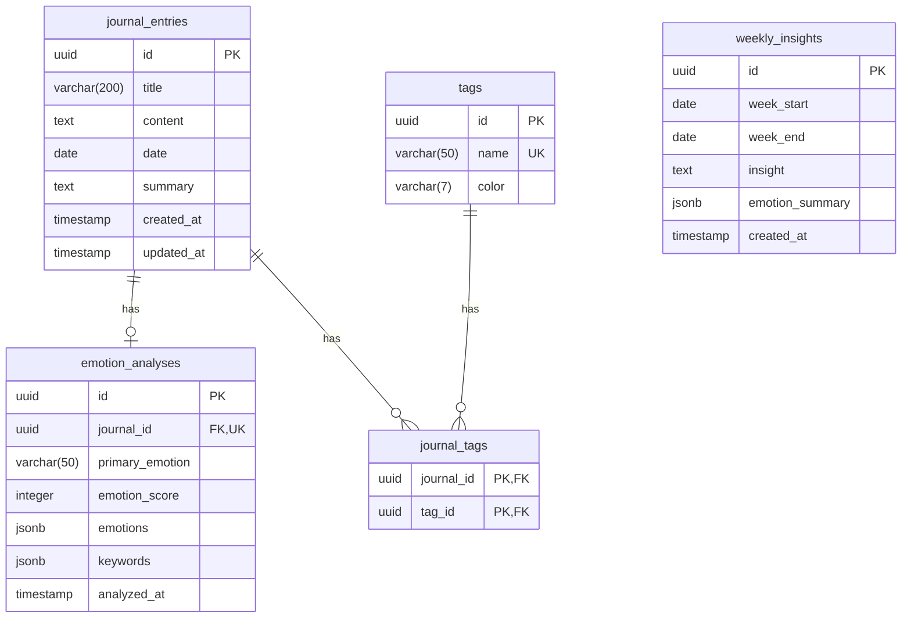

# AI Journal - Database Design

## 1. Schema Design

### 1.1 ERD (Entity Relationship Diagram)



### 1.2 Relationship Summary

| Relationship | Type | Description |
|-------------|------|-------------|
| journal_entries → emotion_analyses | 1:1 | 각 일기는 최대 1개의 감정 분석 |
| journal_entries → journal_tags | 1:N | 일기는 여러 태그 가능 |
| tags → journal_tags | 1:N | 태그는 여러 일기에 사용 |
| journal_entries ↔ tags | N:M | 다대다 (junction: journal_tags) |

---

## 2. Table Details

### 2.1 journal_entries

| Column | Type | Constraints | Description |
|--------|------|-------------|-------------|
| id | UUID | PK, DEFAULT random | 고유 식별자 |
| title | VARCHAR(200) | NOT NULL | 일기 제목 |
| content | TEXT | NOT NULL | 일기 내용 |
| date | DATE | NOT NULL | 일기 날짜 |
| summary | TEXT | NULLABLE | AI 요약 결과 |
| created_at | TIMESTAMP | DEFAULT NOW | 생성 시각 |
| updated_at | TIMESTAMP | DEFAULT NOW | 수정 시각 |

**Indexes:**
- `idx_journal_entries_date` ON (date DESC) - 날짜별 조회 최적화

---

### 2.2 emotion_analyses

| Column | Type | Constraints | Description |
|--------|------|-------------|-------------|
| id | UUID | PK, DEFAULT random | 고유 식별자 |
| journal_id | UUID | FK, NOT NULL, UNIQUE | journal_entries.id 참조 |
| primary_emotion | VARCHAR(50) | NOT NULL | 주요 감정 (한글) |
| emotion_score | INTEGER | NOT NULL, CHECK 1-10 | 감정 점수 |
| emotions | JSONB | NOT NULL | 감정별 점수 객체 |
| keywords | JSONB | NOT NULL | 키워드 배열 |
| analyzed_at | TIMESTAMP | DEFAULT NOW | 분석 시각 |

**JSONB Structure - emotions:**
```json
{
  "happiness": 7,
  "sadness": 2,
  "anger": 1,
  "anxiety": 3,
  "calm": 6,
  "gratitude": 8
}
```

**JSONB Structure - keywords:**
```json
["성취감", "감사", "평화"]
```

**Indexes:**
- `idx_emotion_analyses_journal` ON (journal_id) - FK 조인 최적화

**Cascade:** journal 삭제 시 자동 삭제

---

### 2.3 tags

| Column | Type | Constraints | Description |
|--------|------|-------------|-------------|
| id | UUID | PK, DEFAULT random | 고유 식별자 |
| name | VARCHAR(50) | NOT NULL, UNIQUE | 태그 이름 |
| color | VARCHAR(7) | NOT NULL, DEFAULT '#3B82F6' | HEX 색상 코드 |

**Unique Constraint:** name 중복 방지

---

### 2.4 journal_tags (Junction Table)

| Column | Type | Constraints | Description |
|--------|------|-------------|-------------|
| journal_id | UUID | PK, FK, NOT NULL | journal_entries.id 참조 |
| tag_id | UUID | PK, FK, NOT NULL | tags.id 참조 |

**Composite Primary Key:** (journal_id, tag_id)

**Indexes:**
- `idx_journal_tags_journal` ON (journal_id) - 일기별 태그 조회
- `idx_journal_tags_tag` ON (tag_id) - 태그별 일기 조회

**Cascade:** journal 또는 tag 삭제 시 자동 삭제

---

### 2.5 weekly_insights

| Column | Type | Constraints | Description |
|--------|------|-------------|-------------|
| id | UUID | PK, DEFAULT random | 고유 식별자 |
| week_start | DATE | NOT NULL | 주 시작일 (월요일) |
| week_end | DATE | NOT NULL | 주 종료일 (일요일) |
| insight | TEXT | NOT NULL | AI 인사이트 내용 |
| emotion_summary | JSONB | NOT NULL | 감정 요약 데이터 |
| created_at | TIMESTAMP | DEFAULT NOW | 생성 시각 |

**Unique Constraint:** (week_start, week_end) - 주별 1개 인사이트

**JSONB Structure - emotion_summary:**
```json
{
  "averageScore": 7.2,
  "dominantEmotion": "감사",
  "emotionCounts": {
    "happiness": 3,
    "gratitude": 4,
    "calm": 2
  }
}
```

---

## 3. Indexes Strategy

### 3.1 Performance Indexes

| Index | Table | Columns | Purpose |
|-------|-------|---------|---------|
| idx_journal_entries_date | journal_entries | date DESC | 날짜별 조회, 캘린더 뷰 |
| idx_emotion_analyses_journal | emotion_analyses | journal_id | JOIN 성능 |
| idx_journal_tags_journal | journal_tags | journal_id | 일기 → 태그 조회 |
| idx_journal_tags_tag | journal_tags | tag_id | 태그 → 일기 필터 |

### 3.2 Search Optimization

전문 검색이 필요한 경우:
```sql
-- PostgreSQL Full-Text Search (optional)
CREATE INDEX idx_journal_content_search
ON journal_entries USING GIN(to_tsvector('korean', content));
```

---

## 4. Drizzle Schema

```typescript
// db/schema.ts
import {
  pgTable,
  uuid,
  varchar,
  text,
  date,
  timestamp,
  integer,
  jsonb,
  primaryKey,
  unique,
  index
} from 'drizzle-orm/pg-core';
import { relations } from 'drizzle-orm';

// ==================== Tables ====================

export const journalEntries = pgTable('journal_entries', {
  id: uuid('id').primaryKey().defaultRandom(),
  title: varchar('title', { length: 200 }).notNull(),
  content: text('content').notNull(),
  date: date('date').notNull(),
  summary: text('summary'),
  createdAt: timestamp('created_at').defaultNow(),
  updatedAt: timestamp('updated_at').defaultNow(),
}, (table) => ({
  dateIdx: index('idx_journal_entries_date').on(table.date),
}));

export const emotionAnalyses = pgTable('emotion_analyses', {
  id: uuid('id').primaryKey().defaultRandom(),
  journalId: uuid('journal_id')
    .references(() => journalEntries.id, { onDelete: 'cascade' })
    .notNull()
    .unique(),
  primaryEmotion: varchar('primary_emotion', { length: 50 }).notNull(),
  emotionScore: integer('emotion_score').notNull(),
  emotions: jsonb('emotions').notNull().$type<EmotionsType>(),
  keywords: jsonb('keywords').notNull().$type<string[]>(),
  analyzedAt: timestamp('analyzed_at').defaultNow(),
}, (table) => ({
  journalIdx: index('idx_emotion_analyses_journal').on(table.journalId),
}));

export const tags = pgTable('tags', {
  id: uuid('id').primaryKey().defaultRandom(),
  name: varchar('name', { length: 50 }).notNull().unique(),
  color: varchar('color', { length: 7 }).notNull().default('#3B82F6'),
});

export const journalTags = pgTable('journal_tags', {
  journalId: uuid('journal_id')
    .references(() => journalEntries.id, { onDelete: 'cascade' })
    .notNull(),
  tagId: uuid('tag_id')
    .references(() => tags.id, { onDelete: 'cascade' })
    .notNull(),
}, (table) => ({
  pk: primaryKey({ columns: [table.journalId, table.tagId] }),
  journalIdx: index('idx_journal_tags_journal').on(table.journalId),
  tagIdx: index('idx_journal_tags_tag').on(table.tagId),
}));

export const weeklyInsights = pgTable('weekly_insights', {
  id: uuid('id').primaryKey().defaultRandom(),
  weekStart: date('week_start').notNull(),
  weekEnd: date('week_end').notNull(),
  insight: text('insight').notNull(),
  emotionSummary: jsonb('emotion_summary').notNull().$type<EmotionSummaryType>(),
  createdAt: timestamp('created_at').defaultNow(),
}, (table) => ({
  uniqueWeek: unique().on(table.weekStart, table.weekEnd),
}));

// ==================== Relations ====================

export const journalEntriesRelations = relations(journalEntries, ({ one, many }) => ({
  emotionAnalysis: one(emotionAnalyses, {
    fields: [journalEntries.id],
    references: [emotionAnalyses.journalId],
  }),
  journalTags: many(journalTags),
}));

export const emotionAnalysesRelations = relations(emotionAnalyses, ({ one }) => ({
  journal: one(journalEntries, {
    fields: [emotionAnalyses.journalId],
    references: [journalEntries.id],
  }),
}));

export const tagsRelations = relations(tags, ({ many }) => ({
  journalTags: many(journalTags),
}));

export const journalTagsRelations = relations(journalTags, ({ one }) => ({
  journal: one(journalEntries, {
    fields: [journalTags.journalId],
    references: [journalEntries.id],
  }),
  tag: one(tags, {
    fields: [journalTags.tagId],
    references: [tags.id],
  }),
}));

// ==================== Types ====================

export type EmotionsType = {
  happiness: number;
  sadness: number;
  anger: number;
  anxiety: number;
  calm: number;
  gratitude: number;
};

export type EmotionSummaryType = {
  averageScore: number;
  dominantEmotion: string;
  emotionCounts: Record<string, number>;
};

// Inferred types
export type JournalEntry = typeof journalEntries.$inferSelect;
export type NewJournalEntry = typeof journalEntries.$inferInsert;
export type EmotionAnalysis = typeof emotionAnalyses.$inferSelect;
export type Tag = typeof tags.$inferSelect;
export type WeeklyInsight = typeof weeklyInsights.$inferSelect;
```

---

## 5. Migration Strategy

### 5.1 Setup

```bash
# drizzle.config.ts
pnpm add drizzle-orm drizzle-kit pg
```

```typescript
// drizzle.config.ts
import { defineConfig } from 'drizzle-kit';

export default defineConfig({
  schema: './db/schema.ts',
  out: './db/migrations',
  dialect: 'postgresql',
  dbCredentials: {
    url: process.env.DATABASE_URL!,
  },
});
```

### 5.2 Commands

```bash
# Generate migration
pnpm drizzle-kit generate

# Push to database (dev)
pnpm drizzle-kit push

# Open Drizzle Studio
pnpm drizzle-kit studio
```

### 5.3 Verification Checklist

- [ ] 5개 테이블 생성 확인
- [ ] FK 관계 확인
- [ ] Index 생성 확인
- [ ] Unique constraint 확인
- [ ] JSONB 컬럼 확인

---

## 6. Query Patterns

### 6.1 Get Journal with Emotion

```typescript
const journalWithEmotion = await db.query.journalEntries.findFirst({
  where: eq(journalEntries.id, journalId),
  with: {
    emotionAnalysis: true,
    journalTags: {
      with: { tag: true }
    }
  }
});
```

### 6.2 Get Journals by Date Range

```typescript
const journals = await db.query.journalEntries.findMany({
  where: and(
    gte(journalEntries.date, startDate),
    lte(journalEntries.date, endDate)
  ),
  with: { emotionAnalysis: true },
  orderBy: [desc(journalEntries.date)]
});
```

### 6.3 Get Journals by Tag

```typescript
const journalsByTag = await db
  .select()
  .from(journalEntries)
  .innerJoin(journalTags, eq(journalEntries.id, journalTags.journalId))
  .where(eq(journalTags.tagId, tagId))
  .orderBy(desc(journalEntries.date));
```

### 6.4 Calculate Emotion Statistics

```typescript
const emotionStats = await db
  .select({
    primaryEmotion: emotionAnalyses.primaryEmotion,
    count: sql<number>`count(*)`,
    avgScore: sql<number>`avg(${emotionAnalyses.emotionScore})`
  })
  .from(emotionAnalyses)
  .innerJoin(journalEntries, eq(emotionAnalyses.journalId, journalEntries.id))
  .where(and(
    gte(journalEntries.date, startDate),
    lte(journalEntries.date, endDate)
  ))
  .groupBy(emotionAnalyses.primaryEmotion);
```

### 6.5 Get Weekly Journals for Insight

```typescript
const weeklyJournals = await db.query.journalEntries.findMany({
  where: and(
    gte(journalEntries.date, weekStart),
    lte(journalEntries.date, weekEnd)
  ),
  with: { emotionAnalysis: true },
  orderBy: [asc(journalEntries.date)]
});
```

### 6.6 Search Journals

```typescript
const searchResults = await db
  .select()
  .from(journalEntries)
  .where(or(
    ilike(journalEntries.title, `%${query}%`),
    ilike(journalEntries.content, `%${query}%`)
  ))
  .orderBy(desc(journalEntries.date))
  .limit(20);
```
