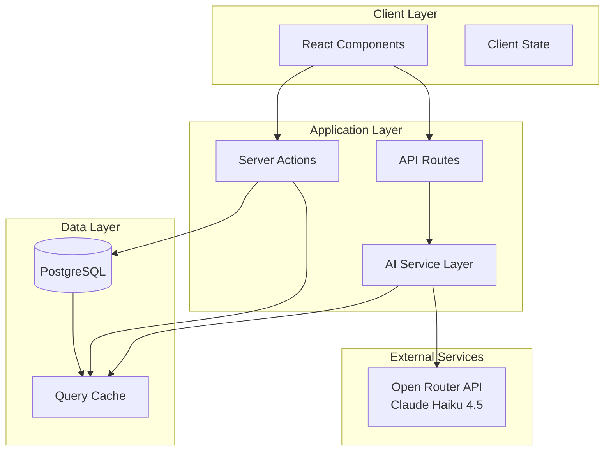
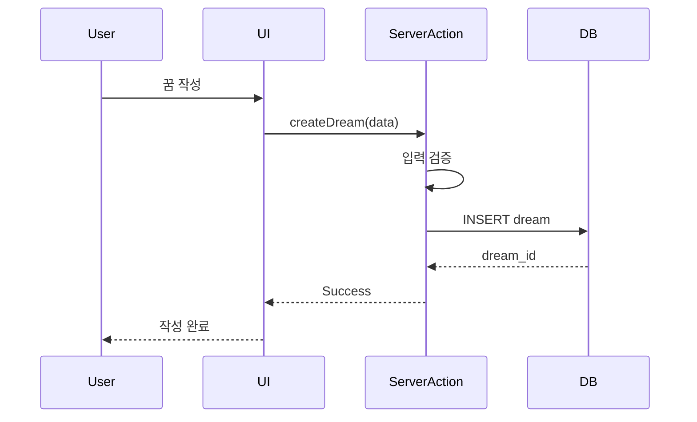
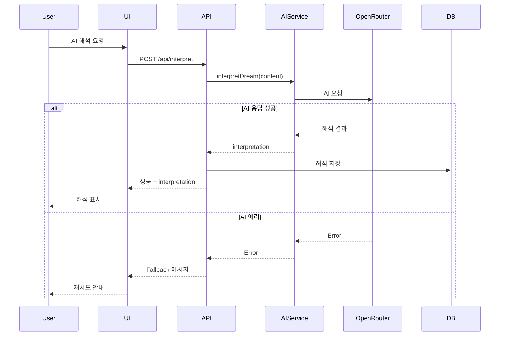
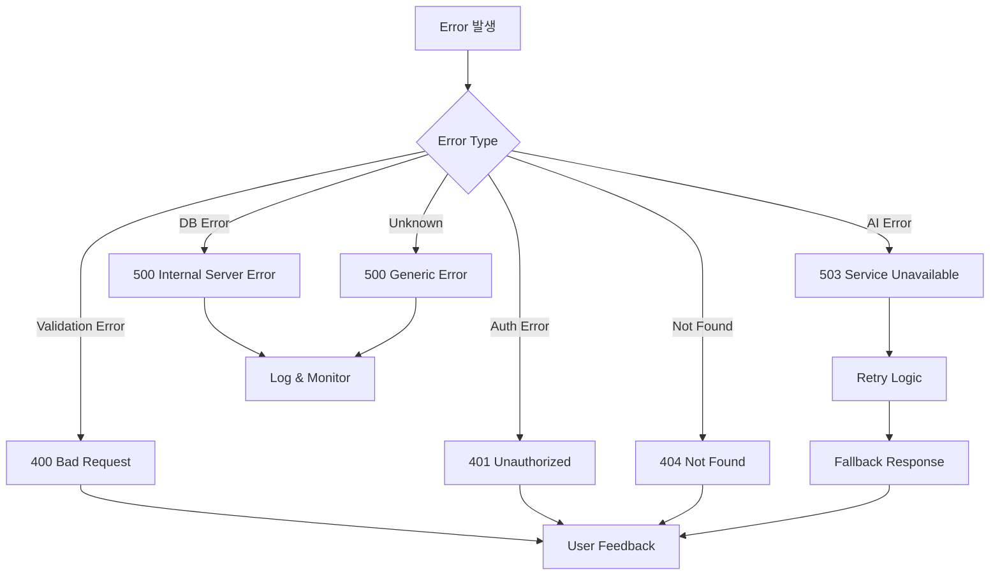

# AI Dream Journal - 시스템 아키텍처

## 1. 시스템 개요

Next.js 14 (App Router) 기반 AI 꿈 분석 애플리케이션. PostgreSQL + AI SDK를 활용한 꿈 기록, 해석, 패턴 분석 시스템.

### 기술 스택
- Frontend: Next.js 14 (App Router), TypeScript, Tailwind CSS, shadcn/ui
- Backend: Next.js API Routes, Server Actions
- Database: PostgreSQL + Drizzle ORM
- AI: AI SDK + Open Router (Claude Haiku 4.5)
- Visualization: Recharts

---

## 2. 시스템 아키텍처



---

## 3. 데이터 플로우

### 3.1 꿈 작성 플로우


### 3.2 AI 해석 플로우


---

## 4. 데이터베이스 설계

### 4.1 스키마 & 인덱스

#### dreams 테이블
```sql
CREATE TABLE dreams (
  id UUID PRIMARY KEY DEFAULT gen_random_uuid(),
  title VARCHAR(255) NOT NULL,
  content TEXT NOT NULL,
  date DATE NOT NULL,
  emotion VARCHAR(20) NOT NULL, -- 'positive', 'neutral', 'negative'
  vividness INTEGER CHECK (vividness BETWEEN 1 AND 5),
  lucid BOOLEAN DEFAULT false,
  created_at TIMESTAMP DEFAULT NOW(),
  updated_at TIMESTAMP DEFAULT NOW()
);

-- 인덱스
CREATE INDEX idx_dreams_date ON dreams(date DESC);
CREATE INDEX idx_dreams_emotion ON dreams(emotion);
CREATE INDEX idx_dreams_created_at ON dreams(created_at DESC);
CREATE INDEX idx_dreams_content_fts ON dreams USING gin(to_tsvector('english', content));
```

**인덱스 전략:**
- `date DESC`: 캘린더 뷰, 최근 꿈 조회
- `emotion`: 감정별 필터링
- `created_at DESC`: 최근 작성 순 정렬
- Full-text search: 꿈 내용 검색

#### interpretations 테이블
```sql
CREATE TABLE interpretations (
  id UUID PRIMARY KEY DEFAULT gen_random_uuid(),
  dream_id UUID NOT NULL REFERENCES dreams(id) ON DELETE CASCADE,
  interpretation TEXT NOT NULL,
  psychological TEXT,
  symbolic TEXT,
  message TEXT,
  analyzed_at TIMESTAMP DEFAULT NOW()
);

-- 인덱스
CREATE UNIQUE INDEX idx_interpretations_dream_id ON interpretations(dream_id);
CREATE INDEX idx_interpretations_analyzed_at ON interpretations(analyzed_at DESC);
```

**인덱스 전략:**
- `dream_id UNIQUE`: 꿈당 하나의 해석만, 빠른 조회
- `analyzed_at`: 최근 해석 조회

#### symbols 테이블
```sql
CREATE TABLE symbols (
  id UUID PRIMARY KEY DEFAULT gen_random_uuid(),
  dream_id UUID NOT NULL REFERENCES dreams(id) ON DELETE CASCADE,
  symbol VARCHAR(100) NOT NULL,
  category VARCHAR(20) NOT NULL, -- 'person', 'place', 'object', 'action', 'emotion'
  meaning TEXT,
  frequency INTEGER DEFAULT 1,
  created_at TIMESTAMP DEFAULT NOW()
);

-- 인덱스
CREATE INDEX idx_symbols_dream_id ON symbols(dream_id);
CREATE INDEX idx_symbols_symbol ON symbols(symbol);
CREATE INDEX idx_symbols_category ON symbols(category);
CREATE INDEX idx_symbols_frequency ON symbols(frequency DESC);
```

**인덱스 전략:**
- `dream_id`: 꿈별 상징 조회
- `symbol`: 특정 상징 검색
- `category`: 카테고리별 필터
- `frequency DESC`: 자주 나오는 상징 통계

#### patterns 테이블
```sql
CREATE TABLE patterns (
  id UUID PRIMARY KEY DEFAULT gen_random_uuid(),
  type VARCHAR(20) NOT NULL, -- 'theme', 'person', 'place', 'emotion'
  name VARCHAR(255) NOT NULL,
  description TEXT,
  occurrences INTEGER DEFAULT 1,
  dream_ids TEXT[], -- PostgreSQL array
  significance TEXT,
  created_at TIMESTAMP DEFAULT NOW(),
  updated_at TIMESTAMP DEFAULT NOW()
);

-- 인덱스
CREATE INDEX idx_patterns_type ON patterns(type);
CREATE INDEX idx_patterns_occurrences ON patterns(occurrences DESC);
CREATE INDEX idx_patterns_updated_at ON patterns(updated_at DESC);
```

**인덱스 전략:**
- `type`: 패턴 유형별 필터
- `occurrences DESC`: 빈도순 정렬
- `updated_at DESC`: 최근 업데이트된 패턴

---

## 5. AI API 최적화

### 5.1 비용 최적화

#### 모델 선택
```typescript
// Haiku: 빠르고 저렴 (해석, 상징, 패턴)
const model = openrouter('anthropic/claude-haiku-4-5')

// 비용 계산
// Input: $0.25/1M tokens
// Output: $1.25/1M tokens
// 평균 꿈: 300 tokens → 해석 생성: ~$0.0005/request
```

#### 프롬프트 최적화
```typescript
// ❌ 나쁜 예: 장황한 프롬프트
const prompt = `당신은 세계 최고의 꿈 해석 전문가이며... (500 tokens)`

// ✅ 좋은 예: 간결한 프롬프트
const prompt = `꿈 해석 전문가. 다음 JSON 형식으로 응답: {...} (50 tokens)`
```

### 5.2 성능 최적화

#### 캐싱 전략
```typescript
// 유사한 꿈 해석 캐싱
import { unstable_cache } from 'next/cache'

const getCachedInterpretation = unstable_cache(
  async (dreamId: string) => {
    return await db.query.interpretations.findFirst({
      where: eq(interpretations.dreamId, dreamId)
    })
  },
  ['dream-interpretation'],
  { revalidate: 3600 } // 1시간 캐시
)
```

#### 병렬 처리
```typescript
// 해석 + 상징 추출 동시 실행
const [interpretation, symbols] = await Promise.all([
  interpretDream(dream.content),
  extractSymbols(dream.content)
])
```

#### Rate Limiting
```typescript
// 사용자당 API 호출 제한
import { Ratelimit } from '@upstash/ratelimit'

const ratelimit = new Ratelimit({
  redis: Redis.fromEnv(),
  limiter: Ratelimit.slidingWindow(10, '1 m'), // 분당 10회
})

export async function POST(req: Request) {
  const { success } = await ratelimit.limit(userId)
  if (!success) {
    return new Response('Rate limit exceeded', { status: 429 })
  }
  // ...
}
```

### 5.3 스트리밍 응답
```typescript
import { streamText } from 'ai'

export async function POST(req: Request) {
  const result = streamText({
    model: openrouter('anthropic/claude-haiku-4-5'),
    prompt: '...',
  })

  return result.toDataStreamResponse()
}
```

---

## 6. 에러 핸들링

### 6.1 에러 계층 구조



### 6.2 에러 클래스

```typescript
// lib/errors.ts
export class AppError extends Error {
  constructor(
    public statusCode: number,
    public message: string,
    public code: string
  ) {
    super(message)
    this.name = 'AppError'
  }
}

export class ValidationError extends AppError {
  constructor(message: string) {
    super(400, message, 'VALIDATION_ERROR')
  }
}

export class AIServiceError extends AppError {
  constructor(message: string) {
    super(503, message, 'AI_SERVICE_ERROR')
  }
}

export class DatabaseError extends AppError {
  constructor(message: string) {
    super(500, message, 'DATABASE_ERROR')
  }
}
```

### 6.3 에러 핸들러 미들웨어

```typescript
// lib/error-handler.ts
export function errorHandler(error: unknown) {
  if (error instanceof AppError) {
    return {
      success: false,
      error: {
        code: error.code,
        message: error.message,
      },
      statusCode: error.statusCode,
    }
  }

  // AI API 에러
  if (error instanceof Error && error.message.includes('OpenRouter')) {
    return {
      success: false,
      error: {
        code: 'AI_SERVICE_ERROR',
        message: 'AI 서비스가 일시적으로 응답하지 않습니다. 잠시 후 다시 시도해주세요.',
      },
      statusCode: 503,
    }
  }

  // 알 수 없는 에러
  console.error('Unexpected error:', error)
  return {
    success: false,
    error: {
      code: 'UNKNOWN_ERROR',
      message: '예상치 못한 오류가 발생했습니다.',
    },
    statusCode: 500,
  }
}
```

### 6.4 Server Action 에러 처리

```typescript
// app/actions/dream.ts
'use server'

export async function createDream(data: CreateDreamInput) {
  try {
    // 입력 검증
    const validated = dreamSchema.parse(data)

    // DB 작업
    const dream = await db.insert(dreams).values(validated).returning()

    return { success: true, data: dream[0] }
  } catch (error) {
    return errorHandler(error)
  }
}
```

### 6.5 API Route 에러 처리

```typescript
// app/api/interpret/route.ts
export async function POST(req: Request) {
  try {
    const body = await req.json()

    // AI 호출
    const interpretation = await interpretDream(body.content)

    return Response.json({ success: true, data: interpretation })
  } catch (error) {
    const handled = errorHandler(error)
    return Response.json(handled, { status: handled.statusCode })
  }
}
```

### 6.6 AI 에러 재시도 로직

```typescript
// lib/ai-service.ts
async function callAIWithRetry<T>(
  fn: () => Promise<T>,
  maxRetries = 3,
  delay = 1000
): Promise<T> {
  for (let i = 0; i < maxRetries; i++) {
    try {
      return await fn()
    } catch (error) {
      if (i === maxRetries - 1) throw error

      // Rate limit 에러면 더 긴 딜레이
      const waitTime = error.message.includes('rate limit')
        ? delay * 5
        : delay

      await new Promise(resolve => setTimeout(resolve, waitTime))
    }
  }
  throw new Error('Max retries exceeded')
}

export async function interpretDream(content: string) {
  return callAIWithRetry(async () => {
    const result = await generateObject({
      model: openrouter('anthropic/claude-haiku-4-5'),
      prompt: `...`,
      schema: interpretationSchema,
    })
    return result.object
  })
}
```

---

## 7. 입력 검증

### 7.1 Zod 스키마

```typescript
// lib/schemas.ts
import { z } from 'zod'

export const dreamSchema = z.object({
  title: z.string()
    .min(1, '제목을 입력해주세요')
    .max(255, '제목은 255자 이하여야 합니다'),

  content: z.string()
    .min(10, '내용은 최소 10자 이상 입력해주세요')
    .max(10000, '내용은 10,000자 이하여야 합니다'),

  date: z.coerce.date()
    .max(new Date(), '미래 날짜는 선택할 수 없습니다'),

  emotion: z.enum(['positive', 'neutral', 'negative'], {
    errorMap: () => ({ message: '올바른 감정을 선택해주세요' })
  }),

  vividness: z.number()
    .int('정수만 입력 가능합니다')
    .min(1, '생생함은 1-5 사이여야 합니다')
    .max(5, '생생함은 1-5 사이여야 합니다'),

  lucid: z.boolean().default(false),
})

export const interpretRequestSchema = z.object({
  dreamId: z.string().uuid('올바른 UUID가 아닙니다'),
  content: z.string().min(1),
})

export const searchSchema = z.object({
  query: z.string().optional(),
  startDate: z.coerce.date().optional(),
  endDate: z.coerce.date().optional(),
  emotions: z.array(z.enum(['positive', 'neutral', 'negative'])).optional(),
  tags: z.array(z.string()).optional(),
  minVividness: z.number().min(1).max(5).optional(),
  maxVividness: z.number().min(1).max(5).optional(),
}).refine(
  (data) => !data.startDate || !data.endDate || data.startDate <= data.endDate,
  { message: '시작 날짜는 종료 날짜보다 이전이어야 합니다' }
)
```

### 7.2 Client-Side 검증

```typescript
// components/dream-form.tsx
'use client'

import { useForm } from 'react-hook-form'
import { zodResolver } from '@hookform/resolvers/zod'

export function DreamForm() {
  const form = useForm({
    resolver: zodResolver(dreamSchema),
    defaultValues: {
      title: '',
      content: '',
      date: new Date(),
      emotion: 'neutral',
      vividness: 3,
      lucid: false,
    },
  })

  async function onSubmit(data: z.infer<typeof dreamSchema>) {
    try {
      const result = await createDream(data)
      if (!result.success) {
        form.setError('root', { message: result.error.message })
      }
    } catch (error) {
      form.setError('root', { message: '저장 중 오류가 발생했습니다' })
    }
  }

  return (
    <form onSubmit={form.handleSubmit(onSubmit)}>
      {/* ... */}
    </form>
  )
}
```

### 7.3 Server-Side 검증

```typescript
// app/actions/dream.ts
'use server'

import { dreamSchema } from '@/lib/schemas'

export async function createDream(input: unknown) {
  try {
    // 1. 스키마 검증
    const validated = dreamSchema.parse(input)

    // 2. 비즈니스 로직 검증
    const existingDream = await db.query.dreams.findFirst({
      where: and(
        eq(dreams.date, validated.date),
        eq(dreams.title, validated.title)
      )
    })

    if (existingDream) {
      throw new ValidationError('같은 날짜에 동일한 제목의 꿈이 이미 있습니다')
    }

    // 3. 저장
    const dream = await db.insert(dreams).values(validated).returning()

    return { success: true, data: dream[0] }
  } catch (error) {
    if (error instanceof z.ZodError) {
      return {
        success: false,
        error: {
          code: 'VALIDATION_ERROR',
          message: error.errors[0].message,
        },
      }
    }
    return errorHandler(error)
  }
}
```

---

## 8. Edge Cases 처리

### 8.1 데이터 관련

| Edge Case | 처리 방법 |
|-----------|-----------|
| 빈 꿈 내용 | 최소 10자 검증 (Zod) |
| 과도하게 긴 내용 | 10,000자 제한 |
| 미래 날짜 | 날짜 검증 (최대 오늘) |
| 중복 날짜/제목 | DB 조회 후 경고 |
| 존재하지 않는 꿈 ID | 404 응답, 리다이렉트 |
| 삭제된 꿈 참조 | CASCADE 삭제 설정 |

### 8.2 AI 관련

| Edge Case | 처리 방법 |
|-----------|-----------|
| AI 응답 없음 | 3회 재시도, 타임아웃 30초 |
| 잘못된 JSON 응답 | Zod로 검증, 실패 시 재시도 |
| Rate limit 초과 | 429 응답, 사용자에게 대기 안내 |
| API 키 만료 | 500 에러, 관리자 알림 |
| 너무 짧은 꿈 (<50자) | 해석 불가 안내 메시지 |
| 비속어/부적절한 내용 | 그대로 처리 (검열 없음) |

```typescript
// AI 호출 타임아웃
export async function interpretDream(content: string) {
  const controller = new AbortController()
  const timeoutId = setTimeout(() => controller.abort(), 30000) // 30초

  try {
    const result = await generateObject({
      model: openrouter('anthropic/claude-haiku-4-5'),
      prompt: `...`,
      schema: interpretationSchema,
      abortSignal: controller.signal,
    })

    clearTimeout(timeoutId)
    return result.object
  } catch (error) {
    clearTimeout(timeoutId)
    if (error.name === 'AbortError') {
      throw new AIServiceError('AI 응답 시간이 초과되었습니다')
    }
    throw error
  }
}
```

### 8.3 UI/UX 관련

| Edge Case | 처리 방법 |
|-----------|-----------|
| 네트워크 오프라인 | 오프라인 안내, 재시도 버튼 |
| 느린 AI 응답 | 로딩 스피너, 진행 상태 표시 |
| 빈 통계 데이터 | "아직 데이터가 없습니다" 메시지 |
| 검색 결과 없음 | 빈 상태 UI, 필터 초기화 제안 |
| 이미지/파일 업로드 | 미지원 기능 안내 |

```typescript
// 빈 상태 처리
export function DreamList({ dreams }: { dreams: Dream[] }) {
  if (dreams.length === 0) {
    return (
      <EmptyState
        icon={Moon}
        title="아직 기록한 꿈이 없습니다"
        description="첫 꿈을 기록해보세요!"
        action={
          <Button onClick={onCreateDream}>
            새 꿈 기록하기
          </Button>
        }
      />
    )
  }

  return <div>{/* 꿈 리스트 */}</div>
}
```

### 8.4 데이터 일관성

| Edge Case | 처리 방법 |
|-----------|-----------|
| 해석 없는 상징 | NULL 허용, UI에서 필터 |
| 패턴 업데이트 실패 | 트랜잭션 롤백 |
| 동시 수정 충돌 | Optimistic locking (updated_at) |
| 고아 레코드 | CASCADE DELETE + 주기적 정리 |

```typescript
// 트랜잭션 처리
export async function analyzeDreamComplete(dreamId: string, content: string) {
  return await db.transaction(async (tx) => {
    // 1. 해석 생성
    const interpretation = await interpretDream(content)
    await tx.insert(interpretations).values({
      dreamId,
      ...interpretation,
    })

    // 2. 상징 추출
    const symbols = await extractSymbols(content)
    await tx.insert(symbols).values(
      symbols.map(s => ({ dreamId, ...s }))
    )

    // 3. 패턴 업데이트
    await updatePatterns(dreamId)

    return { success: true }
  })
}
```

---

## 9. 보안 고려사항

### 9.1 환경 변수 보호
```typescript
// lib/env.ts
import { z } from 'zod'

const envSchema = z.object({
  DATABASE_URL: z.string().url(),
  OPENROUTER_API_KEY: z.string().min(1),
  NODE_ENV: z.enum(['development', 'production', 'test']),
})

export const env = envSchema.parse(process.env)
```

### 9.2 SQL Injection 방지
```typescript
// ✅ Drizzle ORM 사용 (자동 파라미터화)
const dreams = await db.query.dreams.findMany({
  where: eq(dreams.title, userInput) // 안전
})

// ❌ Raw SQL 직접 사용 금지
// await db.execute(`SELECT * FROM dreams WHERE title = '${userInput}'`)
```

### 9.3 XSS 방지
```typescript
// React는 기본적으로 XSS 방지
<div>{dream.content}</div> // 자동 이스케이프

// dangerouslySetInnerHTML 사용 금지
// <div dangerouslySetInnerHTML={{ __html: dream.content }} />
```

---

## 10. 모니터링 & 로깅

### 10.1 로깅 전략
```typescript
// lib/logger.ts
export const logger = {
  info: (message: string, meta?: any) => {
    console.log(`[INFO] ${message}`, meta)
  },
  error: (message: string, error: Error, meta?: any) => {
    console.error(`[ERROR] ${message}`, {
      error: error.message,
      stack: error.stack,
      ...meta,
    })
  },
  ai: (action: string, duration: number) => {
    console.log(`[AI] ${action} completed in ${duration}ms`)
  },
}

// 사용
export async function interpretDream(content: string) {
  const start = Date.now()
  try {
    const result = await generateObject(...)
    logger.ai('interpretDream', Date.now() - start)
    return result.object
  } catch (error) {
    logger.error('Failed to interpret dream', error, { content })
    throw error
  }
}
```

### 10.2 성능 메트릭
- AI 요청 응답 시간
- DB 쿼리 실행 시간
- API Route 응답 시간
- 에러 발생 빈도

---

## 요약

### 핵심 설계 원칙
1. **간결성**: 과도한 추상화 지양, 실용적 구현
2. **안정성**: 3단계 에러 핸들링 (Validation → Retry → Fallback)
3. **성능**: 인덱스 최적화, 병렬 처리, 캐싱
4. **확장성**: 모듈화된 AI 서비스 레이어

### 주요 최적화
- **DB**: 7개 전략적 인덱스
- **AI**: 재시도 로직, 타임아웃, Rate limiting
- **검증**: Zod 기반 클라이언트/서버 이중 검증
- **에러**: 계층화된 에러 클래스, 사용자 친화적 메시지
