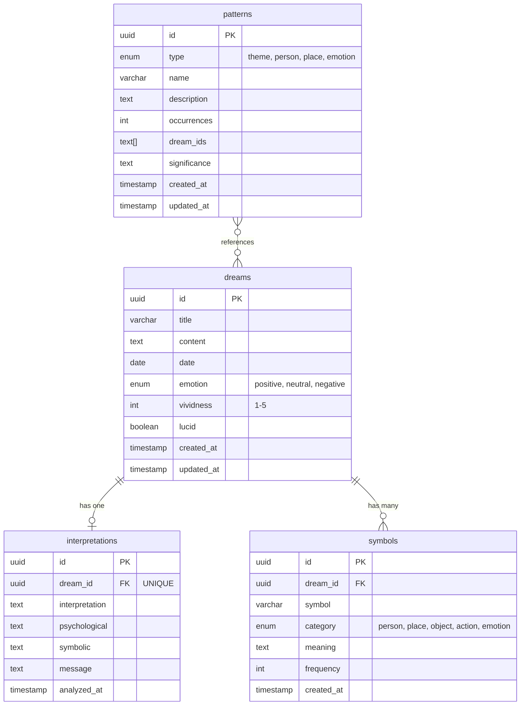

# AI Dream Journal - 데이터베이스 설계

## 스키마 개요

AI Dream Journal은 4개의 주요 테이블로 구성됩니다:
1. **dreams** - 사용자가 기록한 꿈 데이터
2. **interpretations** - AI가 생성한 꿈 해석
3. **symbols** - 꿈에서 추출된 상징 및 의미
4. **patterns** - 반복되는 꿈 패턴 분석 결과

---

## ERD (Entity Relationship Diagram)



---

## 관계 설명

### 1. dreams → interpretations (1:1)
- 하나의 꿈은 **최대 하나의 해석**을 가질 수 있습니다
- `interpretations.dream_id`는 UNIQUE 제약조건이 있습니다
- 꿈이 삭제되면 해석도 함께 삭제됩니다 (CASCADE DELETE)

### 2. dreams → symbols (1:N)
- 하나의 꿈은 **여러 개의 상징**을 가질 수 있습니다
- AI가 꿈 내용을 분석하여 상징을 자동 추출합니다
- 꿈이 삭제되면 관련 상징도 함께 삭제됩니다 (CASCADE DELETE)

### 3. patterns ↔ dreams (M:N)
- 하나의 패턴은 **여러 꿈**과 연관됩니다
- `patterns.dream_ids`는 PostgreSQL의 TEXT[] 배열로 관련 꿈 ID를 저장합니다
- 명시적인 조인 테이블 대신 배열을 사용하여 구조를 단순화했습니다

---

## 테이블 정의

### 1. dreams (꿈 기록)

사용자가 작성한 꿈 일기 데이터를 저장하는 핵심 테이블입니다.

| 필드 | 타입 | 제약조건 | 설명 |
|------|------|----------|------|
| `id` | UUID | PRIMARY KEY | 고유 식별자 (자동 생성) |
| `title` | VARCHAR(255) | NOT NULL | 꿈 제목 (최대 255자) |
| `content` | TEXT | NOT NULL | 꿈 내용 (제한 없음) |
| `date` | DATE | NOT NULL | 꿈을 꾼 날짜 |
| `emotion` | ENUM | NOT NULL | 감정: `positive`, `neutral`, `negative` |
| `vividness` | INTEGER | NOT NULL, CHECK(1-5) | 생생함 정도 (1-5) |
| `lucid` | BOOLEAN | DEFAULT false | 자각몽 여부 |
| `created_at` | TIMESTAMP | DEFAULT NOW() | 기록 생성 시간 |
| `updated_at` | TIMESTAMP | DEFAULT NOW() | 기록 수정 시간 |

**인덱스:**
- `idx_dreams_date` - 날짜 기반 조회 (캘린더 뷰)
- `idx_dreams_created_at` - 최근 기록 조회
- `idx_dreams_emotion` - 감정별 필터링
- `idx_dreams_content_fts` - 전체 텍스트 검색

**특징:**
- `emotion`은 통계 차트에 사용됩니다
- `vividness`는 생생함 추이 차트에 사용됩니다
- `date`는 실제 꿈을 꾼 날짜로, `created_at`과 다를 수 있습니다

---

### 2. interpretations (AI 해석)

AI가 생성한 꿈 해석 결과를 저장합니다.

| 필드 | 타입 | 제약조건 | 설명 |
|------|------|----------|------|
| `id` | UUID | PRIMARY KEY | 고유 식별자 |
| `dream_id` | UUID | FK → dreams, UNIQUE | 연결된 꿈 ID (1:1 관계) |
| `interpretation` | TEXT | NOT NULL | 전체적인 해석 |
| `psychological` | TEXT | NULL | 심리학적 관점 (프로이트, 융 등) |
| `symbolic` | TEXT | NULL | 상징적 의미 |
| `message` | TEXT | NULL | 꿈이 전하는 메시지 |
| `analyzed_at` | TIMESTAMP | DEFAULT NOW() | AI 분석 시간 |

**인덱스:**
- `idx_interpretations_dream_id` - UNIQUE 인덱스 (1:1 관계 보장)
- `idx_interpretations_analyzed_at` - 최근 해석 조회

**특징:**
- `dream_id`는 UNIQUE하므로 꿈당 하나의 해석만 존재합니다
- 4가지 관점의 해석을 분리하여 저장합니다:
  1. `interpretation` - 전체 해석
  2. `psychological` - 심리학적 분석
  3. `symbolic` - 상징 해석
  4. `message` - 메시지
- ON DELETE CASCADE로 꿈 삭제 시 함께 삭제됩니다

---

### 3. symbols (상징)

AI가 꿈에서 추출한 상징과 그 의미를 저장합니다.

| 필드 | 타입 | 제약조건 | 설명 |
|------|------|----------|------|
| `id` | UUID | PRIMARY KEY | 고유 식별자 |
| `dream_id` | UUID | FK → dreams | 연결된 꿈 ID |
| `symbol` | VARCHAR(100) | NOT NULL | 상징 이름 (예: "물", "하늘", "늑대") |
| `category` | ENUM | NOT NULL | 카테고리: `person`, `place`, `object`, `action`, `emotion` |
| `meaning` | TEXT | NULL | 상징의 의미 설명 |
| `frequency` | INTEGER | DEFAULT 1 | 전체 꿈에서 등장 횟수 |
| `created_at` | TIMESTAMP | DEFAULT NOW() | 생성 시간 |

**인덱스:**
- `idx_symbols_dream_id` - 꿈별 상징 조회
- `idx_symbols_symbol` - 특정 상징 검색
- `idx_symbols_category` - 카테고리별 필터
- `idx_symbols_frequency` - 빈도순 정렬 (통계)

**카테고리 설명:**
- `person` - 사람, 동물 (예: 친구, 늑대)
- `place` - 장소, 환경 (예: 숲, 바다)
- `object` - 사물 (예: 열쇠, 책)
- `action` - 행동 (예: 날기, 달리기)
- `emotion` - 감정 (예: 두려움, 행복)

**특징:**
- `frequency`는 앱 전체에서 해당 상징이 등장한 횟수를 추적합니다
- "자주 나오는 상징" 통계에 활용됩니다

---

### 4. patterns (패턴)

반복되는 꿈 패턴과 그 의미를 저장합니다.

| 필드 | 타입 | 제약조건 | 설명 |
|------|------|----------|------|
| `id` | UUID | PRIMARY KEY | 고유 식별자 |
| `type` | ENUM | NOT NULL | 패턴 유형: `theme`, `person`, `place`, `emotion` |
| `name` | VARCHAR(255) | NOT NULL | 패턴 이름 (예: "물 관련 꿈") |
| `description` | TEXT | NULL | 패턴 상세 설명 |
| `occurrences` | INTEGER | DEFAULT 1 | 발생 횟수 |
| `dream_ids` | TEXT[] | NOT NULL | 관련 꿈 ID 배열 (M:N 관계) |
| `significance` | TEXT | NULL | AI가 분석한 패턴의 의미 |
| `created_at` | TIMESTAMP | DEFAULT NOW() | 생성 시간 |
| `updated_at` | TIMESTAMP | DEFAULT NOW() | 마지막 업데이트 시간 |

**인덱스:**
- `idx_patterns_type` - 패턴 유형별 필터
- `idx_patterns_occurrences` - 빈도순 정렬
- `idx_patterns_updated_at` - 최근 업데이트된 패턴

**패턴 유형:**
- `theme` - 반복되는 주제 (예: "비행", "추격")
- `person` - 자주 등장하는 인물/동물
- `place` - 반복되는 장소
- `emotion` - 일관된 감정 패턴

**특징:**
- `dream_ids`는 PostgreSQL의 TEXT[] 배열 타입을 사용합니다
- AI가 주기적으로 패턴을 탐지하고 업데이트합니다
- `updated_at`은 패턴이 새로운 꿈과 연결될 때마다 갱신됩니다

---

## Drizzle 스키마 코드

### 완전한 schema.ts

```typescript
// db/schema.ts
import { pgTable, uuid, varchar, text, date, integer, boolean, timestamp, pgEnum } from 'drizzle-orm/pg-core'
import { relations } from 'drizzle-orm'
import { createInsertSchema, createSelectSchema } from 'drizzle-zod'
import { z } from 'zod'

// ========================================
// Enums
// ========================================

export const emotionEnum = pgEnum('emotion', ['positive', 'neutral', 'negative'])
export const symbolCategoryEnum = pgEnum('symbol_category', ['person', 'place', 'object', 'action', 'emotion'])
export const patternTypeEnum = pgEnum('pattern_type', ['theme', 'person', 'place', 'emotion'])

// ========================================
// Tables
// ========================================

// 1. dreams 테이블
export const dreams = pgTable('dreams', {
  id: uuid('id').defaultRandom().primaryKey(),
  title: varchar('title', { length: 255 }).notNull(),
  content: text('content').notNull(),
  date: date('date').notNull(),
  emotion: emotionEnum('emotion').notNull(),
  vividness: integer('vividness').notNull(), // 1-5
  lucid: boolean('lucid').default(false).notNull(),
  createdAt: timestamp('created_at').defaultNow().notNull(),
  updatedAt: timestamp('updated_at').defaultNow().notNull(),
})

// 2. interpretations 테이블
export const interpretations = pgTable('interpretations', {
  id: uuid('id').defaultRandom().primaryKey(),
  dreamId: uuid('dream_id')
    .notNull()
    .references(() => dreams.id, { onDelete: 'cascade' })
    .unique(), // 1:1 관계
  interpretation: text('interpretation').notNull(),
  psychological: text('psychological'),
  symbolic: text('symbolic'),
  message: text('message'),
  analyzedAt: timestamp('analyzed_at').defaultNow().notNull(),
})

// 3. symbols 테이블
export const symbols = pgTable('symbols', {
  id: uuid('id').defaultRandom().primaryKey(),
  dreamId: uuid('dream_id')
    .notNull()
    .references(() => dreams.id, { onDelete: 'cascade' }),
  symbol: varchar('symbol', { length: 100 }).notNull(),
  category: symbolCategoryEnum('category').notNull(),
  meaning: text('meaning'),
  frequency: integer('frequency').default(1).notNull(),
  createdAt: timestamp('created_at').defaultNow().notNull(),
})

// 4. patterns 테이블
export const patterns = pgTable('patterns', {
  id: uuid('id').defaultRandom().primaryKey(),
  type: patternTypeEnum('type').notNull(),
  name: varchar('name', { length: 255 }).notNull(),
  description: text('description'),
  occurrences: integer('occurrences').default(1).notNull(),
  dreamIds: text('dream_ids').array().notNull(), // TEXT[] 배열
  significance: text('significance'),
  createdAt: timestamp('created_at').defaultNow().notNull(),
  updatedAt: timestamp('updated_at').defaultNow().notNull(),
})

// ========================================
// Relations
// ========================================

export const dreamsRelations = relations(dreams, ({ one, many }) => ({
  interpretation: one(interpretations, {
    fields: [dreams.id],
    references: [interpretations.dreamId],
  }),
  symbols: many(symbols),
}))

export const interpretationsRelations = relations(interpretations, ({ one }) => ({
  dream: one(dreams, {
    fields: [interpretations.dreamId],
    references: [dreams.id],
  }),
}))

export const symbolsRelations = relations(symbols, ({ one }) => ({
  dream: one(dreams, {
    fields: [symbols.dreamId],
    references: [dreams.id],
  }),
}))

// ========================================
// Zod Schemas (Validation)
// ========================================

// Insert Schemas
export const insertDreamSchema = createInsertSchema(dreams, {
  title: z.string().min(1, '제목을 입력해주세요').max(255, '제목은 255자 이하여야 합니다'),
  content: z.string().min(10, '내용은 최소 10자 이상 입력해주세요').max(10000, '내용은 10,000자 이하여야 합니다'),
  date: z.coerce.date().max(new Date(), '미래 날짜는 선택할 수 없습니다'),
  emotion: z.enum(['positive', 'neutral', 'negative']),
  vividness: z.number().int().min(1).max(5, '생생함은 1-5 사이여야 합니다'),
  lucid: z.boolean().default(false),
})

export const insertInterpretationSchema = createInsertSchema(interpretations, {
  dreamId: z.string().uuid(),
  interpretation: z.string().min(1),
})

export const insertSymbolSchema = createInsertSchema(symbols, {
  dreamId: z.string().uuid(),
  symbol: z.string().min(1).max(100),
  category: z.enum(['person', 'place', 'object', 'action', 'emotion']),
  frequency: z.number().int().min(1).default(1),
})

export const insertPatternSchema = createInsertSchema(patterns, {
  type: z.enum(['theme', 'person', 'place', 'emotion']),
  name: z.string().min(1).max(255),
  dreamIds: z.array(z.string().uuid()).min(1, '최소 하나의 꿈 ID가 필요합니다'),
  occurrences: z.number().int().min(1).default(1),
})

// Select Schemas
export const selectDreamSchema = createSelectSchema(dreams)
export const selectInterpretationSchema = createSelectSchema(interpretations)
export const selectSymbolSchema = createSelectSchema(symbols)
export const selectPatternSchema = createSelectSchema(patterns)

// ========================================
// Type Inference
// ========================================

// Insert Types (클라이언트에서 데이터 생성 시 사용)
export type InsertDream = z.infer<typeof insertDreamSchema>
export type InsertInterpretation = z.infer<typeof insertInterpretationSchema>
export type InsertSymbol = z.infer<typeof insertSymbolSchema>
export type InsertPattern = z.infer<typeof insertPatternSchema>

// Select Types (DB에서 데이터 조회 시 사용)
export type Dream = z.infer<typeof selectDreamSchema>
export type Interpretation = z.infer<typeof selectInterpretationSchema>
export type Symbol = z.infer<typeof selectSymbolSchema>
export type Pattern = z.infer<typeof selectPatternSchema>

// Joined Types (관계 포함)
export type DreamWithInterpretation = Dream & {
  interpretation?: Interpretation | null
}

export type DreamWithSymbols = Dream & {
  symbols: Symbol[]
}

export type DreamWithAll = Dream & {
  interpretation?: Interpretation | null
  symbols: Symbol[]
}
```

---

## 인덱스 전략

### 1. Date-based Queries (날짜 기반 조회)

```sql
-- 캘린더 뷰: 특정 월의 모든 꿈 조회
CREATE INDEX idx_dreams_date ON dreams(date DESC);

-- 최근 작성된 꿈 조회
CREATE INDEX idx_dreams_created_at ON dreams(created_at DESC);

-- 최근 AI 해석 조회
CREATE INDEX idx_interpretations_analyzed_at ON interpretations(analyzed_at DESC);
```

**사용 쿼리 예시:**
```typescript
// 2026년 1월의 모든 꿈 조회 (캘린더)
const januaryDreams = await db.query.dreams.findMany({
  where: and(
    gte(dreams.date, '2026-01-01'),
    lte(dreams.date, '2026-01-31')
  ),
  orderBy: desc(dreams.date),
})

// 최근 10개 꿈 조회 (홈 화면)
const recentDreams = await db.query.dreams.findMany({
  limit: 10,
  orderBy: desc(dreams.createdAt),
})
```

### 2. Foreign Key Indexes (외래 키 조회)

```sql
-- 특정 꿈의 해석 조회 (1:1)
CREATE UNIQUE INDEX idx_interpretations_dream_id ON interpretations(dream_id);

-- 특정 꿈의 모든 상징 조회 (1:N)
CREATE INDEX idx_symbols_dream_id ON symbols(dream_id);
```

**사용 쿼리 예시:**
```typescript
// 꿈과 해석을 함께 조회
const dreamWithInterpretation = await db.query.dreams.findFirst({
  where: eq(dreams.id, dreamId),
  with: {
    interpretation: true,
  },
})

// 꿈과 상징들을 함께 조회
const dreamWithSymbols = await db.query.dreams.findFirst({
  where: eq(dreams.id, dreamId),
  with: {
    symbols: true,
  },
})
```

### 3. Search Optimization (검색 최적화)

```sql
-- 전체 텍스트 검색 (제목, 내용)
CREATE INDEX idx_dreams_content_fts ON dreams
  USING gin(to_tsvector('english', content));

-- 특정 상징 검색
CREATE INDEX idx_symbols_symbol ON symbols(symbol);

-- 감정별 필터링
CREATE INDEX idx_dreams_emotion ON dreams(emotion);
```

**사용 쿼리 예시:**
```typescript
// 제목/내용 검색
const searchResults = await db.query.dreams.findMany({
  where: or(
    like(dreams.title, `%${query}%`),
    like(dreams.content, `%${query}%`)
  ),
})

// 특정 상징이 포함된 꿈 찾기
const dreamsWithSymbol = await db
  .select()
  .from(dreams)
  .innerJoin(symbols, eq(symbols.dreamId, dreams.id))
  .where(eq(symbols.symbol, '물'))
```

### 4. Statistics Indexes (통계 조회)

```sql
-- 카테고리별 상징 통계
CREATE INDEX idx_symbols_category ON symbols(category);

-- 자주 나오는 상징 (빈도순)
CREATE INDEX idx_symbols_frequency ON symbols(frequency DESC);

-- 패턴 유형별 필터
CREATE INDEX idx_patterns_type ON patterns(type);

-- 발생 횟수 기준 정렬
CREATE INDEX idx_patterns_occurrences ON patterns(occurrences DESC);
```

**사용 쿼리 예시:**
```typescript
// 가장 많이 등장한 상징 TOP 10
const topSymbols = await db.query.symbols.findMany({
  orderBy: desc(symbols.frequency),
  limit: 10,
})

// 테마 유형 패턴만 조회
const themePatterns = await db.query.patterns.findMany({
  where: eq(patterns.type, 'theme'),
  orderBy: desc(patterns.occurrences),
})
```

---

## 마이그레이션 명령어

### 1. Drizzle 설정

```typescript
// drizzle.config.ts
import type { Config } from 'drizzle-kit'

export default {
  schema: './db/schema.ts',
  out: './drizzle',
  dialect: 'postgresql',
  dbCredentials: {
    url: process.env.DATABASE_URL!,
  },
} satisfies Config
```

### 2. 마이그레이션 생성

```bash
# 스키마 변경사항을 기반으로 마이그레이션 파일 생성
npx drizzle-kit generate
```

**생성되는 파일:**
- `drizzle/0000_initial_schema.sql`
- `drizzle/meta/_journal.json`

### 3. 마이그레이션 실행

```bash
# DB에 직접 스키마 푸시 (개발 환경, 빠른 프로토타입)
npx drizzle-kit push

# 또는 마이그레이션 파일 실행 (프로덕션 환경)
npx drizzle-kit migrate
```

### 4. DB 검증

```bash
# DB 스키마 확인
npx drizzle-kit check

# Drizzle Studio 실행 (GUI)
npx drizzle-kit studio
```

**Drizzle Studio:**
- 브라우저에서 DB 데이터 확인 및 수정
- 기본 주소: `https://local.drizzle.studio`

### 5. 마이그레이션 롤백

```bash
# 마이그레이션 롤백 (마지막 마이그레이션 취소)
npx drizzle-kit drop
```

### 6. 프로덕션 마이그레이션 스크립트

```typescript
// scripts/migrate.ts
import { drizzle } from 'drizzle-orm/postgres-js'
import { migrate } from 'drizzle-orm/postgres-js/migrator'
import postgres from 'postgres'

async function main() {
  const sql = postgres(process.env.DATABASE_URL!, { max: 1 })
  const db = drizzle(sql)

  console.log('Running migrations...')
  await migrate(db, { migrationsFolder: './drizzle' })
  console.log('Migrations completed!')

  await sql.end()
}

main()
```

**실행:**
```bash
npx tsx scripts/migrate.ts
```

---

## DB 클라이언트 설정

### db/index.ts

```typescript
import { drizzle } from 'drizzle-orm/postgres-js'
import postgres from 'postgres'
import * as schema from './schema'

const connectionString = process.env.DATABASE_URL!

// PostgreSQL 연결
export const client = postgres(connectionString)

// Drizzle 인스턴스
export const db = drizzle(client, { schema })
```

**사용 예시:**
```typescript
import { db } from '@/db'
import { dreams } from '@/db/schema'
import { desc } from 'drizzle-orm'

// 최근 꿈 조회
const recentDreams = await db.query.dreams.findMany({
  orderBy: desc(dreams.createdAt),
  limit: 10,
  with: {
    interpretation: true,
    symbols: true,
  },
})
```

---

## 요약

### 핵심 설계 원칙
1. **정규화**: 1:1, 1:N 관계를 명확히 정의
2. **성능**: 11개의 전략적 인덱스로 쿼리 최적화
3. **데이터 무결성**: CASCADE DELETE, UNIQUE 제약조건
4. **확장성**: TEXT[] 배열을 활용한 M:N 관계 단순화

### 인덱스 요약
- **Date-based**: 3개 (date, created_at, analyzed_at)
- **Foreign Key**: 2개 (dream_id in interpretations, symbols)
- **Search**: 3개 (content FTS, symbol, emotion)
- **Statistics**: 3개 (category, frequency, type)

### 주요 특징
- **Type-safe**: Drizzle + Zod로 완전한 타입 안정성
- **Validation**: Insert/Select 스키마 분리
- **Relations**: Drizzle relations API로 조인 간소화
- **Migration**: `drizzle-kit`으로 자동 마이그레이션
