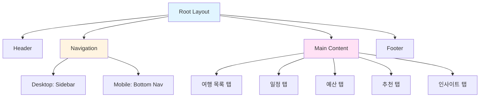
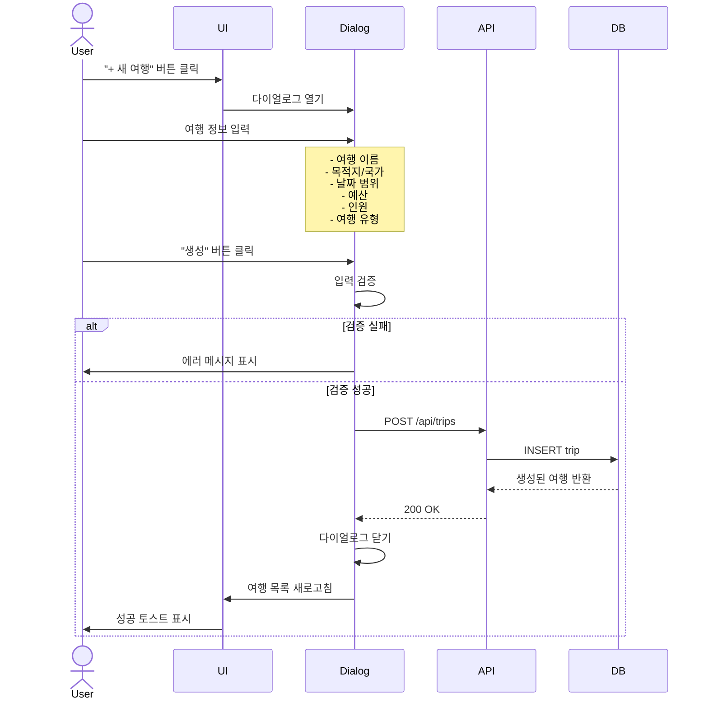
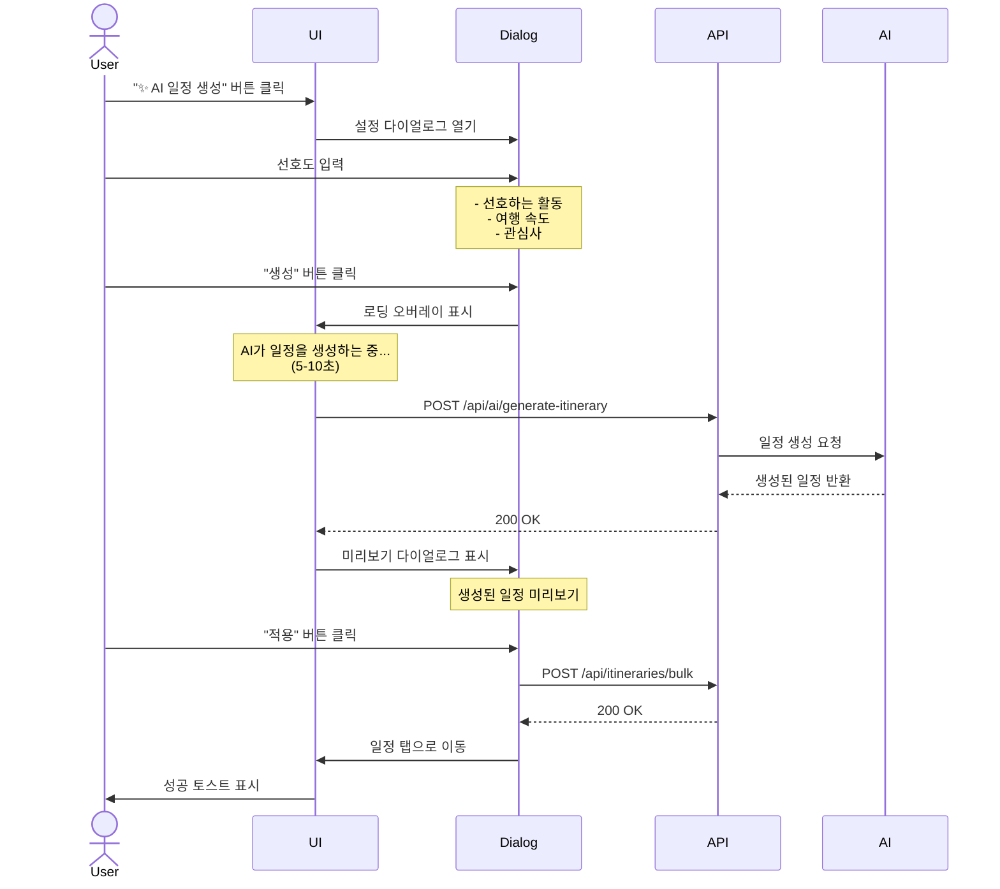
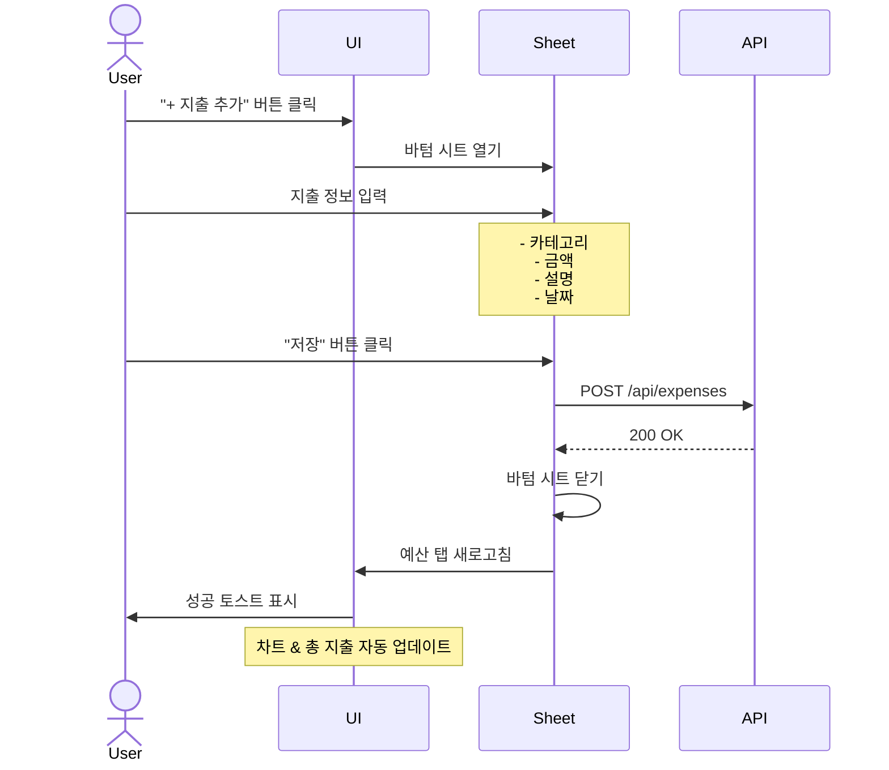

# AI Travel Planner - UI 디자인 문서

## 1. 디자인 시스템

### 1.1 컬러 팔레트

```typescript
// Tailwind CSS 기반 컬러

const colors = {
  primary: {
    50: '#eff6ff',   // 하늘색 (배경)
    100: '#dbeafe',
    500: '#3b82f6',  // 파란색 (주요 액션)
    600: '#2563eb',
    700: '#1d4ed8',
  },
  secondary: {
    500: '#8b5cf6',  // 보라색 (AI 기능)
    600: '#7c3aed',
  },
  success: {
    500: '#10b981',  // 초록색 (완료)
  },
  warning: {
    500: '#f59e0b',  // 주황색 (경고)
  },
  danger: {
    500: '#ef4444',  // 빨간색 (예산 초과)
  },
  neutral: {
    50: '#f9fafb',
    100: '#f3f4f6',
    200: '#e5e7eb',
    500: '#6b7280',
    700: '#374151',
    900: '#111827',
  },
};
```

### 1.2 타이포그래피

```css
/* Pretendard 폰트 (한글 최적화) */

h1 { font-size: 2.25rem; font-weight: 700; } /* 36px */
h2 { font-size: 1.875rem; font-weight: 600; } /* 30px */
h3 { font-size: 1.5rem; font-weight: 600; } /* 24px */
h4 { font-size: 1.25rem; font-weight: 600; } /* 20px */

body { font-size: 1rem; font-weight: 400; } /* 16px */
small { font-size: 0.875rem; } /* 14px */
caption { font-size: 0.75rem; } /* 12px */
```

### 1.3 간격 시스템

```typescript
const spacing = {
  xs: '0.5rem',   // 8px
  sm: '0.75rem',  // 12px
  md: '1rem',     // 16px
  lg: '1.5rem',   // 24px
  xl: '2rem',     // 32px
  '2xl': '3rem',  // 48px
};
```

### 1.4 그림자 & 경계선

```css
/* 그림자 */
.shadow-sm { box-shadow: 0 1px 2px 0 rgba(0, 0, 0, 0.05); }
.shadow-md { box-shadow: 0 4px 6px -1px rgba(0, 0, 0, 0.1); }
.shadow-lg { box-shadow: 0 10px 15px -3px rgba(0, 0, 0, 0.1); }

/* 경계선 */
.border { border: 1px solid #e5e7eb; }
.rounded-md { border-radius: 0.375rem; } /* 6px */
.rounded-lg { border-radius: 0.5rem; } /* 8px */
```

---

## 2. 페이지 구조

### 2.1 전체 레이아웃



### 2.2 레이아웃 구조

```
┌─────────────────────────────────────────────────────────┐
│  Header                                                 │
│  ✈️ AI Travel Planner    [+ 새 여행]  [알림] [프로필]  │
├─────────────┬───────────────────────────────────────────┤
│             │  Tabs Navigation                          │
│  Sidebar    │  [여행 목록] [일정] [예산] [추천] [인사이트] │
│  (Desktop)  ├───────────────────────────────────────────┤
│             │                                           │
│  - 여행 목록 │                                           │
│  - 일정     │           Main Content Area              │
│  - 예산     │                                           │
│  - AI 추천  │                                           │
│  - 인사이트 │                                           │
│             │                                           │
└─────────────┴───────────────────────────────────────────┘
```

**모바일 레이아웃**:
```
┌─────────────────────────────────┐
│  Header                         │
│  ✈️ AI Travel Planner    [메뉴] │
├─────────────────────────────────┤
│                                 │
│                                 │
│       Main Content              │
│       (Full Width)              │
│                                 │
│                                 │
├─────────────────────────────────┤
│  Bottom Navigation              │
│  [🏠] [📅] [💰] [⭐] [📊]        │
└─────────────────────────────────┘
```

---

## 3. shadcn/ui 컴포넌트

### 3.1 기본 컴포넌트

#### Button
```tsx
import { Button } from '@/components/ui/button';

// 사용 예시
<Button variant="default">저장</Button>
<Button variant="outline">취소</Button>
<Button variant="ghost">더보기</Button>
<Button variant="destructive">삭제</Button>

// AI 기능 버튼 (보라색)
<Button className="bg-purple-600 hover:bg-purple-700">
  ✨ AI 일정 생성
</Button>
```

**변형**:
- `default`: 파란색 (주요 액션)
- `outline`: 테두리만 (보조 액션)
- `ghost`: 배경 없음 (텍스트 버튼)
- `destructive`: 빨간색 (삭제)

#### Card
```tsx
import { Card, CardHeader, CardTitle, CardContent } from '@/components/ui/card';

<Card>
  <CardHeader>
    <CardTitle>파리 여행</CardTitle>
  </CardHeader>
  <CardContent>
    <p>2026년 3월 15일 - 3월 20일</p>
  </CardContent>
</Card>
```

#### Input & Select
```tsx
import { Input } from '@/components/ui/input';
import { Select, SelectTrigger, SelectValue, SelectContent, SelectItem } from '@/components/ui/select';

// 입력 필드
<Input
  type="text"
  placeholder="여행 이름을 입력하세요"
  value={name}
  onChange={(e) => setName(e.target.value)}
/>

// 선택 필드
<Select value={tripType} onValueChange={setTripType}>
  <SelectTrigger>
    <SelectValue placeholder="여행 유형 선택" />
  </SelectTrigger>
  <SelectContent>
    <SelectItem value="vacation">휴양</SelectItem>
    <SelectItem value="business">출장</SelectItem>
    <SelectItem value="adventure">배낭여행</SelectItem>
  </SelectContent>
</Select>
```

#### Tabs
```tsx
import { Tabs, TabsList, TabsTrigger, TabsContent } from '@/components/ui/tabs';

<Tabs defaultValue="trips">
  <TabsList>
    <TabsTrigger value="trips">여행 목록</TabsTrigger>
    <TabsTrigger value="itinerary">일정</TabsTrigger>
    <TabsTrigger value="budget">예산</TabsTrigger>
    <TabsTrigger value="recommendations">추천</TabsTrigger>
    <TabsTrigger value="insights">인사이트</TabsTrigger>
  </TabsList>

  <TabsContent value="trips">
    {/* 여행 목록 내용 */}
  </TabsContent>
</Tabs>
```

### 3.2 고급 컴포넌트

#### Calendar
```tsx
import { Calendar } from '@/components/ui/calendar';

<Calendar
  mode="range"
  selected={dateRange}
  onSelect={setDateRange}
  numberOfMonths={2}
/>
```

#### Badge
```tsx
import { Badge } from '@/components/ui/badge';

// 상태 표시
<Badge variant="default">진행 중</Badge>
<Badge variant="secondary">계획 중</Badge>
<Badge variant="success">완료</Badge>
<Badge variant="destructive">예산 초과</Badge>

// 카테고리 표시
<Badge className="bg-blue-100 text-blue-700">교통</Badge>
<Badge className="bg-green-100 text-green-700">숙박</Badge>
<Badge className="bg-yellow-100 text-yellow-700">식비</Badge>
```

#### Dialog
```tsx
import { Dialog, DialogContent, DialogHeader, DialogTitle, DialogFooter } from '@/components/ui/dialog';

<Dialog open={isOpen} onOpenChange={setIsOpen}>
  <DialogContent>
    <DialogHeader>
      <DialogTitle>새 여행 만들기</DialogTitle>
    </DialogHeader>

    {/* 폼 내용 */}
    <div className="space-y-4">
      <Input placeholder="여행 이름" />
      <Input placeholder="목적지" />
    </div>

    <DialogFooter>
      <Button variant="outline" onClick={() => setIsOpen(false)}>
        취소
      </Button>
      <Button onClick={handleSubmit}>
        생성
      </Button>
    </DialogFooter>
  </DialogContent>
</Dialog>
```

#### Sheet (모바일 메뉴)
```tsx
import { Sheet, SheetContent, SheetHeader, SheetTitle, SheetTrigger } from '@/components/ui/sheet';

<Sheet>
  <SheetTrigger asChild>
    <Button variant="ghost" size="icon">
      <MenuIcon />
    </Button>
  </SheetTrigger>

  <SheetContent side="left">
    <SheetHeader>
      <SheetTitle>메뉴</SheetTitle>
    </SheetHeader>

    <nav className="flex flex-col gap-4 mt-8">
      <a href="/trips">여행 목록</a>
      <a href="/itinerary">일정</a>
      <a href="/budget">예산</a>
    </nav>
  </SheetContent>
</Sheet>
```

### 3.3 차트 (Recharts)

#### Pie Chart (예산 사용 현황)
```tsx
import { PieChart, Pie, Cell, ResponsiveContainer, Legend, Tooltip } from 'recharts';

const data = [
  { name: '교통', value: 400000, color: '#3b82f6' },
  { name: '숙박', value: 800000, color: '#10b981' },
  { name: '식비', value: 500000, color: '#f59e0b' },
  { name: '활동', value: 300000, color: '#8b5cf6' },
];

<ResponsiveContainer width="100%" height={300}>
  <PieChart>
    <Pie
      data={data}
      dataKey="value"
      nameKey="name"
      cx="50%"
      cy="50%"
      outerRadius={80}
      label
    >
      {data.map((entry, index) => (
        <Cell key={`cell-${index}`} fill={entry.color} />
      ))}
    </Pie>
    <Tooltip formatter={(value) => `₩${value.toLocaleString()}`} />
    <Legend />
  </PieChart>
</ResponsiveContainer>
```

#### Bar Chart (카테고리별 지출)
```tsx
import { BarChart, Bar, XAxis, YAxis, CartesianGrid, Tooltip, ResponsiveContainer } from 'recharts';

const data = [
  { category: '교통', amount: 400000 },
  { category: '숙박', amount: 800000 },
  { category: '식비', amount: 500000 },
  { category: '활동', amount: 300000 },
];

<ResponsiveContainer width="100%" height={300}>
  <BarChart data={data}>
    <CartesianGrid strokeDasharray="3 3" />
    <XAxis dataKey="category" />
    <YAxis />
    <Tooltip formatter={(value) => `₩${value.toLocaleString()}`} />
    <Bar dataKey="amount" fill="#3b82f6" />
  </BarChart>
</ResponsiveContainer>
```

#### Line Chart (일별 지출 추이)
```tsx
import { LineChart, Line, XAxis, YAxis, CartesianGrid, Tooltip, ResponsiveContainer } from 'recharts';

const data = [
  { date: '03/15', amount: 150000 },
  { date: '03/16', amount: 320000 },
  { date: '03/17', amount: 280000 },
  { date: '03/18', amount: 190000 },
  { date: '03/19', amount: 250000 },
];

<ResponsiveContainer width="100%" height={300}>
  <LineChart data={data}>
    <CartesianGrid strokeDasharray="3 3" />
    <XAxis dataKey="date" />
    <YAxis />
    <Tooltip formatter={(value) => `₩${value.toLocaleString()}`} />
    <Line type="monotone" dataKey="amount" stroke="#3b82f6" strokeWidth={2} />
  </LineChart>
</ResponsiveContainer>
```

---

## 4. 커스텀 컴포넌트

### 4.1 TripCard

여행 목록에 표시되는 카드 컴포넌트.

```tsx
// components/trips/TripCard.tsx

import { Card, CardHeader, CardTitle, CardContent } from '@/components/ui/card';
import { Badge } from '@/components/ui/badge';
import { CalendarIcon, MapPinIcon, UsersIcon } from 'lucide-react';
import { Trip } from '@/lib/db/schema';

interface TripCardProps {
  trip: Trip;
  onClick?: () => void;
}

export function TripCard({ trip, onClick }: TripCardProps) {
  const budgetUsage = (Number(trip.actualSpent) / Number(trip.budget)) * 100;

  return (
    <Card
      className="cursor-pointer hover:shadow-lg transition-shadow"
      onClick={onClick}
    >
      <CardHeader>
        <div className="flex items-start justify-between">
          <CardTitle className="text-xl">{trip.name}</CardTitle>
          <Badge variant={getStatusVariant(trip.status)}>
            {getStatusLabel(trip.status)}
          </Badge>
        </div>
      </CardHeader>

      <CardContent className="space-y-3">
        {/* 목적지 */}
        <div className="flex items-center gap-2 text-sm text-gray-600">
          <MapPinIcon className="w-4 h-4" />
          <span>{trip.destination}, {trip.country}</span>
        </div>

        {/* 날짜 */}
        <div className="flex items-center gap-2 text-sm text-gray-600">
          <CalendarIcon className="w-4 h-4" />
          <span>
            {formatDate(trip.startDate)} - {formatDate(trip.endDate)}
          </span>
        </div>

        {/* 인원 */}
        <div className="flex items-center gap-2 text-sm text-gray-600">
          <UsersIcon className="w-4 h-4" />
          <span>{trip.travelers}명</span>
        </div>

        {/* 예산 사용률 */}
        <div className="space-y-2">
          <div className="flex justify-between text-sm">
            <span className="text-gray-600">예산 사용</span>
            <span className={budgetUsage > 100 ? 'text-red-600 font-semibold' : 'text-gray-900'}>
              {budgetUsage.toFixed(0)}%
            </span>
          </div>
          <div className="h-2 bg-gray-200 rounded-full overflow-hidden">
            <div
              className={`h-full ${budgetUsage > 100 ? 'bg-red-500' : 'bg-blue-500'}`}
              style={{ width: `${Math.min(budgetUsage, 100)}%` }}
            />
          </div>
          <div className="flex justify-between text-xs text-gray-500">
            <span>₩{Number(trip.actualSpent).toLocaleString()}</span>
            <span>₩{Number(trip.budget).toLocaleString()}</span>
          </div>
        </div>
      </CardContent>
    </Card>
  );
}
```

**미리보기**:
```
┌─────────────────────────────────────┐
│ 파리 봄나들이              [진행 중] │
│                                     │
│ 📍 파리, 프랑스                     │
│ 📅 2026.03.15 - 2026.03.20          │
│ 👥 2명                              │
│                                     │
│ 예산 사용                      85% │
│ ████████████████░░░░               │
│ ₩2,125,000          ₩2,500,000     │
└─────────────────────────────────────┘
```

### 4.2 TimelineItem

일정 타임라인의 개별 항목 컴포넌트.

```tsx
// components/itinerary/TimelineItem.tsx

import { Card } from '@/components/ui/card';
import { Badge } from '@/components/ui/badge';
import { Checkbox } from '@/components/ui/checkbox';
import { MapPinIcon, ClockIcon } from 'lucide-react';
import { Itinerary } from '@/lib/db/schema';

interface TimelineItemProps {
  itinerary: Itinerary;
  onToggleComplete?: (id: string, completed: boolean) => void;
  onEdit?: (id: string) => void;
  onDelete?: (id: string) => void;
}

export function TimelineItem({
  itinerary,
  onToggleComplete,
  onEdit,
  onDelete,
}: TimelineItemProps) {
  return (
    <div className="flex gap-4">
      {/* 시간 표시 */}
      <div className="flex flex-col items-center">
        <div className="text-sm font-medium text-gray-700">
          {formatTime(itinerary.startTime)}
        </div>
        <div className="w-px h-full bg-gray-300 mt-2" />
      </div>

      {/* 내용 카드 */}
      <Card className="flex-1 mb-4">
        <div className="p-4">
          <div className="flex items-start gap-3">
            {/* 완료 체크박스 */}
            <Checkbox
              checked={itinerary.completed}
              onCheckedChange={(checked) =>
                onToggleComplete?.(itinerary.id, checked as boolean)
              }
            />

            <div className="flex-1">
              {/* 활동명 */}
              <h4 className={`font-medium ${itinerary.completed ? 'line-through text-gray-500' : ''}`}>
                {itinerary.activity}
              </h4>

              {/* 시간 & 장소 */}
              <div className="flex items-center gap-4 mt-2 text-sm text-gray-600">
                <div className="flex items-center gap-1">
                  <ClockIcon className="w-4 h-4" />
                  <span>
                    {formatTime(itinerary.startTime)} - {formatTime(itinerary.endTime)}
                  </span>
                </div>

                {itinerary.destination && (
                  <div className="flex items-center gap-1">
                    <MapPinIcon className="w-4 h-4" />
                    <span>{itinerary.destination.name}</span>
                  </div>
                )}
              </div>

              {/* 우선순위 */}
              <div className="mt-2">
                <Badge variant={getPriorityVariant(itinerary.priority)}>
                  {getPriorityLabel(itinerary.priority)}
                </Badge>
              </div>

              {/* 메모 */}
              {itinerary.notes && (
                <p className="mt-2 text-sm text-gray-600">
                  {itinerary.notes}
                </p>
              )}
            </div>

            {/* 액션 버튼 */}
            <div className="flex gap-2">
              <Button variant="ghost" size="sm" onClick={() => onEdit?.(itinerary.id)}>
                수정
              </Button>
              <Button variant="ghost" size="sm" onClick={() => onDelete?.(itinerary.id)}>
                삭제
              </Button>
            </div>
          </div>
        </div>
      </Card>
    </div>
  );
}
```

**미리보기**:
```
10:00  ┌─────────────────────────────────────┐
   │   │ ☑ 에펠탑 방문                        │
   │   │ 🕐 10:00 - 12:00  📍 에펠탑         │
   │   │ [높음]                              │
   │   │ 온라인 예약 필수                     │
   │   │                      [수정] [삭제]   │
   │   └─────────────────────────────────────┘
```

### 4.3 BudgetChart

예산 사용 현황을 시각화하는 차트 컴포넌트.

```tsx
// components/budget/BudgetChart.tsx

import { Card, CardHeader, CardTitle, CardContent } from '@/components/ui/card';
import { PieChart, Pie, Cell, ResponsiveContainer, Legend, Tooltip } from 'recharts';
import { Expense } from '@/lib/db/schema';

interface BudgetChartProps {
  expenses: Expense[];
}

const CATEGORY_COLORS = {
  transport: '#3b82f6',
  accommodation: '#10b981',
  food: '#f59e0b',
  activity: '#8b5cf6',
  shopping: '#ec4899',
  other: '#6b7280',
};

const CATEGORY_LABELS = {
  transport: '교통',
  accommodation: '숙박',
  food: '식비',
  activity: '활동',
  shopping: '쇼핑',
  other: '기타',
};

export function BudgetChart({ expenses }: BudgetChartProps) {
  // 카테고리별 집계
  const categoryTotals = expenses.reduce((acc, expense) => {
    const category = expense.category;
    acc[category] = (acc[category] || 0) + Number(expense.amount);
    return acc;
  }, {} as Record<string, number>);

  // 차트 데이터 변환
  const chartData = Object.entries(categoryTotals).map(([category, amount]) => ({
    name: CATEGORY_LABELS[category as keyof typeof CATEGORY_LABELS],
    value: amount,
    color: CATEGORY_COLORS[category as keyof typeof CATEGORY_COLORS],
  }));

  const totalSpent = chartData.reduce((sum, item) => sum + item.value, 0);

  return (
    <Card>
      <CardHeader>
        <CardTitle>카테고리별 지출</CardTitle>
      </CardHeader>

      <CardContent>
        {/* 총 지출 */}
        <div className="text-center mb-6">
          <p className="text-sm text-gray-600">총 지출</p>
          <p className="text-3xl font-bold text-gray-900">
            ₩{totalSpent.toLocaleString()}
          </p>
        </div>

        {/* 파이 차트 */}
        <ResponsiveContainer width="100%" height={300}>
          <PieChart>
            <Pie
              data={chartData}
              dataKey="value"
              nameKey="name"
              cx="50%"
              cy="50%"
              outerRadius={100}
              label={(entry) => `${((entry.value / totalSpent) * 100).toFixed(0)}%`}
            >
              {chartData.map((entry, index) => (
                <Cell key={`cell-${index}`} fill={entry.color} />
              ))}
            </Pie>
            <Tooltip
              formatter={(value: number) => `₩${value.toLocaleString()}`}
            />
            <Legend />
          </PieChart>
        </ResponsiveContainer>

        {/* 카테고리별 상세 */}
        <div className="space-y-3 mt-6">
          {chartData.map((item) => (
            <div key={item.name} className="flex items-center justify-between">
              <div className="flex items-center gap-2">
                <div
                  className="w-3 h-3 rounded-full"
                  style={{ backgroundColor: item.color }}
                />
                <span className="text-sm">{item.name}</span>
              </div>
              <div className="flex items-center gap-3">
                <span className="text-sm font-medium">
                  ₩{item.value.toLocaleString()}
                </span>
                <span className="text-xs text-gray-500">
                  {((item.value / totalSpent) * 100).toFixed(1)}%
                </span>
              </div>
            </div>
          ))}
        </div>
      </CardContent>
    </Card>
  );
}
```

### 4.4 RecommendationCard

AI 추천을 표시하는 카드 컴포넌트.

```tsx
// components/recommendations/RecommendationCard.tsx

import { Card, CardHeader, CardTitle, CardContent, CardFooter } from '@/components/ui/card';
import { Button } from '@/components/ui/button';
import { Badge } from '@/components/ui/badge';
import { SparklesIcon } from 'lucide-react';
import { AIRecommendation } from '@/lib/db/schema';

interface RecommendationCardProps {
  recommendation: AIRecommendation;
  onApply?: (id: string) => void;
  onDismiss?: (id: string) => void;
}

export function RecommendationCard({
  recommendation,
  onApply,
  onDismiss,
}: RecommendationCardProps) {
  return (
    <Card className={recommendation.applied ? 'bg-purple-50 border-purple-200' : ''}>
      <CardHeader>
        <div className="flex items-start gap-3">
          {/* AI 아이콘 */}
          <div className="p-2 bg-purple-100 rounded-lg">
            <SparklesIcon className="w-5 h-5 text-purple-600" />
          </div>

          <div className="flex-1">
            <div className="flex items-center justify-between">
              <CardTitle className="text-lg">{recommendation.title}</CardTitle>
              <Badge variant={getTypeVariant(recommendation.type)}>
                {getTypeLabel(recommendation.type)}
              </Badge>
            </div>

            <p className="text-xs text-gray-500 mt-1">
              {formatDate(recommendation.createdAt)}
            </p>
          </div>
        </div>
      </CardHeader>

      <CardContent>
        {/* AI 추천 내용 */}
        <div className="prose prose-sm max-w-none">
          {formatContent(recommendation.content)}
        </div>

        {/* 메타데이터 (신뢰도 등) */}
        {recommendation.metadata?.confidence && (
          <div className="mt-4 flex items-center gap-2">
            <span className="text-sm text-gray-600">신뢰도:</span>
            <div className="flex-1 h-2 bg-gray-200 rounded-full overflow-hidden">
              <div
                className="h-full bg-purple-500"
                style={{ width: `${recommendation.metadata.confidence * 100}%` }}
              />
            </div>
            <span className="text-sm font-medium">
              {(recommendation.metadata.confidence * 100).toFixed(0)}%
            </span>
          </div>
        )}
      </CardContent>

      {!recommendation.applied && (
        <CardFooter className="flex gap-2">
          <Button
            className="flex-1 bg-purple-600 hover:bg-purple-700"
            onClick={() => onApply?.(recommendation.id)}
          >
            적용하기
          </Button>
          <Button
            variant="outline"
            onClick={() => onDismiss?.(recommendation.id)}
          >
            무시
          </Button>
        </CardFooter>
      )}

      {recommendation.applied && (
        <CardFooter>
          <Badge variant="success" className="w-full justify-center">
            ✓ 적용됨
          </Badge>
        </CardFooter>
      )}
    </Card>
  );
}
```

**미리보기**:
```
┌─────────────────────────────────────────┐
│ ✨  동선 최적화 제안         [일정 조정] │
│     2026.03.15 생성                    │
│                                         │
│ 현재 일정을 재배치하면 이동 시간을       │
│ 40분 절약할 수 있습니다:                │
│                                         │
│ • A 지역 방문을 오전에 집중            │
│ • 점심 식사를 A 근처에서               │
│ • B 지역을 오후로 이동                 │
│                                         │
│ 신뢰도: ████████░░ 92%                 │
│                                         │
│ [적용하기]              [무시]          │
└─────────────────────────────────────────┘
```

---

## 5. 인터랙션 플로우

### 5.1 여행 생성 플로우



**UI 단계**:

1. **초기 상태**
   - 여행 목록 페이지에 "+ 새 여행" 버튼 표시

2. **다이얼로그 열림**
   ```tsx
   <Dialog open={isOpen} onOpenChange={setIsOpen}>
     <DialogContent>
       <DialogHeader>
         <DialogTitle>새 여행 만들기</DialogTitle>
       </DialogHeader>

       <form onSubmit={handleSubmit} className="space-y-4">
         <Input label="여행 이름" required />
         <Input label="목적지" required />
         <Input label="국가" required />
         <Calendar mode="range" label="날짜" required />
         <Input type="number" label="예산 (원)" required />
         <Input type="number" label="인원" required />
         <Select label="여행 유형" required>
           <SelectItem value="vacation">휴양</SelectItem>
           <SelectItem value="business">출장</SelectItem>
           <SelectItem value="adventure">배낭여행</SelectItem>
         </Select>

         <DialogFooter>
           <Button type="button" variant="outline" onClick={close}>
             취소
           </Button>
           <Button type="submit" disabled={loading}>
             {loading ? '생성 중...' : '생성'}
           </Button>
         </DialogFooter>
       </form>
     </DialogContent>
   </Dialog>
   ```

3. **로딩 상태**
   - 버튼에 스피너 표시
   - 폼 비활성화

4. **성공 상태**
   - 다이얼로그 닫힘
   - 성공 토스트 표시: "✓ 여행이 생성되었습니다"
   - 여행 목록에 새 여행 표시

5. **에러 상태**
   - 에러 메시지 표시 (폼 하단)
   - 입력 필드에 빨간 테두리

### 5.2 AI 일정 생성 플로우



**UI 단계**:

1. **설정 다이얼로그**
   ```tsx
   <Dialog>
     <DialogHeader>
       <DialogTitle>✨ AI 일정 생성</DialogTitle>
       <DialogDescription>
         선호도를 알려주시면 최적의 일정을 생성해드립니다.
       </DialogDescription>
     </DialogHeader>

     <div className="space-y-4">
       <MultiSelect
         label="선호하는 활동"
         options={['관광', '음식', '쇼핑', '문화', '자연']}
       />

       <Select label="여행 속도">
         <SelectItem value="relaxed">여유롭게</SelectItem>
         <SelectItem value="moderate">보통</SelectItem>
         <SelectItem value="packed">빡빡하게</SelectItem>
       </Select>

       <Textarea
         label="추가 요청사항"
         placeholder="특별히 가고 싶은 장소나 피하고 싶은 활동이 있나요?"
       />
     </div>

     <DialogFooter>
       <Button onClick={handleGenerate} className="bg-purple-600">
         생성하기
       </Button>
     </DialogFooter>
   </Dialog>
   ```

2. **로딩 상태** (5-10초)
   ```tsx
   <div className="fixed inset-0 bg-black/50 flex items-center justify-center z-50">
     <Card className="p-8 text-center">
       <SparklesIcon className="w-16 h-16 text-purple-600 mx-auto mb-4 animate-pulse" />
       <h3 className="text-xl font-semibold mb-2">
         AI가 일정을 생성하는 중...
       </h3>
       <p className="text-gray-600">
         최적의 일정을 찾고 있습니다. 잠시만 기다려주세요.
       </p>
       <div className="mt-4 flex justify-center">
         <Spinner />
       </div>
     </Card>
   </div>
   ```

3. **미리보기 다이얼로그**
   ```tsx
   <Dialog>
     <DialogHeader>
       <DialogTitle>생성된 일정 미리보기</DialogTitle>
     </DialogHeader>

     <div className="space-y-4 max-h-96 overflow-y-auto">
       {dailyPlans.map((day) => (
         <Card key={day.date}>
           <CardHeader>
             <CardTitle>{day.theme}</CardTitle>
             <p className="text-sm text-gray-600">{day.date}</p>
           </CardHeader>
           <CardContent>
             {day.activities.map((activity) => (
               <div key={activity.time} className="mb-2">
                 <p className="font-medium">{activity.activity}</p>
                 <p className="text-sm text-gray-600">
                   {activity.time} · {activity.location}
                 </p>
               </div>
             ))}
           </CardContent>
         </Card>
       ))}
     </div>

     <DialogFooter>
       <Button variant="outline" onClick={regenerate}>
         다시 생성
       </Button>
       <Button onClick={apply} className="bg-purple-600">
         적용하기
       </Button>
     </DialogFooter>
   </Dialog>
   ```

### 5.3 지출 기록 플로우



**UI 구현**:

```tsx
<Sheet open={isOpen} onOpenChange={setIsOpen}>
  <SheetContent side="bottom">
    <SheetHeader>
      <SheetTitle>지출 기록</SheetTitle>
    </SheetHeader>

    <form onSubmit={handleSubmit} className="space-y-4 mt-4">
      <Select label="카테고리" required>
        <SelectItem value="transport">🚗 교통</SelectItem>
        <SelectItem value="accommodation">🏨 숙박</SelectItem>
        <SelectItem value="food">🍽️ 식비</SelectItem>
        <SelectItem value="activity">🎭 활동</SelectItem>
        <SelectItem value="shopping">🛍️ 쇼핑</SelectItem>
        <SelectItem value="other">📦 기타</SelectItem>
      </Select>

      <Input
        type="number"
        label="금액 (원)"
        placeholder="0"
        required
      />

      <Input
        label="설명"
        placeholder="무엇을 구매했나요?"
        required
      />

      <Input
        type="date"
        label="날짜"
        required
      />

      <Button type="submit" className="w-full" disabled={loading}>
        {loading ? '저장 중...' : '저장'}
      </Button>
    </form>
  </SheetContent>
</Sheet>
```

### 5.4 에러 & 로딩 상태

#### 에러 상태

**1. 폼 검증 에러**:
```tsx
<div className="rounded-lg border border-red-200 bg-red-50 p-4">
  <div className="flex items-start gap-3">
    <AlertCircleIcon className="w-5 h-5 text-red-600 mt-0.5" />
    <div>
      <h4 className="font-medium text-red-900">입력 오류</h4>
      <ul className="mt-2 text-sm text-red-700 list-disc list-inside">
        <li>여행 이름을 입력하세요</li>
        <li>종료일은 시작일 이후여야 합니다</li>
      </ul>
    </div>
  </div>
</div>
```

**2. API 에러**:
```tsx
<div className="rounded-lg border border-red-200 bg-red-50 p-4">
  <div className="flex items-start gap-3">
    <XCircleIcon className="w-5 h-5 text-red-600" />
    <div>
      <h4 className="font-medium text-red-900">오류가 발생했습니다</h4>
      <p className="mt-1 text-sm text-red-700">
        서버와 통신 중 문제가 발생했습니다. 잠시 후 다시 시도해주세요.
      </p>
      <Button variant="outline" size="sm" className="mt-3" onClick={retry}>
        다시 시도
      </Button>
    </div>
  </div>
</div>
```

**3. AI 생성 실패**:
```tsx
<div className="rounded-lg border border-yellow-200 bg-yellow-50 p-4">
  <div className="flex items-start gap-3">
    <AlertTriangleIcon className="w-5 h-5 text-yellow-600" />
    <div>
      <h4 className="font-medium text-yellow-900">AI 일정 생성 실패</h4>
      <p className="mt-1 text-sm text-yellow-700">
        AI가 일정을 생성하지 못했습니다. 입력 정보를 확인하고 다시 시도해주세요.
      </p>
    </div>
  </div>
</div>
```

#### 로딩 상태

**1. 버튼 로딩**:
```tsx
<Button disabled={loading}>
  {loading && <Spinner className="mr-2 h-4 w-4 animate-spin" />}
  {loading ? '저장 중...' : '저장'}
</Button>
```

**2. 스켈레톤 로딩** (여행 목록):
```tsx
<div className="space-y-4">
  {[1, 2, 3].map((i) => (
    <Card key={i} className="animate-pulse">
      <CardHeader>
        <div className="h-6 bg-gray-200 rounded w-1/2" />
      </CardHeader>
      <CardContent className="space-y-3">
        <div className="h-4 bg-gray-200 rounded w-3/4" />
        <div className="h-4 bg-gray-200 rounded w-2/3" />
        <div className="h-4 bg-gray-200 rounded w-1/2" />
      </CardContent>
    </Card>
  ))}
</div>
```

**3. 전체 페이지 로딩**:
```tsx
<div className="flex items-center justify-center h-screen">
  <div className="text-center">
    <Spinner className="w-12 h-12 mx-auto mb-4" />
    <p className="text-gray-600">로딩 중...</p>
  </div>
</div>
```

**4. AI 생성 로딩** (특별 처리):
```tsx
<div className="fixed inset-0 bg-black/50 flex items-center justify-center z-50">
  <Card className="p-8 text-center max-w-md">
    <SparklesIcon className="w-16 h-16 text-purple-600 mx-auto mb-4 animate-pulse" />
    <h3 className="text-xl font-semibold mb-2">
      AI가 일정을 생성하는 중...
    </h3>
    <p className="text-gray-600 mb-4">
      최적의 일정을 찾고 있습니다.
    </p>
    <div className="w-full bg-gray-200 rounded-full h-2">
      <div
        className="bg-purple-600 h-2 rounded-full transition-all duration-300"
        style={{ width: `${progress}%` }}
      />
    </div>
    <p className="text-sm text-gray-500 mt-2">약 {estimatedTime}초 남음</p>
  </Card>
</div>
```

---

## 6. 반응형 전략

### 6.1 브레이크포인트

```typescript
const breakpoints = {
  mobile: '< 768px',
  tablet: '768px - 1024px',
  desktop: '> 1024px',
};

// Tailwind CSS
// sm: 640px
// md: 768px
// lg: 1024px
// xl: 1280px
// 2xl: 1536px
```

### 6.2 레이아웃 전략

#### Mobile (< 768px)

**특징**:
- 단일 컬럼 레이아웃
- 하단 네비게이션 바
- 풀 스크린 다이얼로그
- 스와이프 제스처

```tsx
// app/layout.tsx

<div className="flex flex-col min-h-screen">
  {/* 헤더 */}
  <header className="sticky top-0 z-40 border-b bg-white">
    <div className="flex items-center justify-between p-4">
      <h1 className="text-lg font-bold">✈️ AI Travel Planner</h1>
      <Button variant="ghost" size="icon">
        <MenuIcon />
      </Button>
    </div>
  </header>

  {/* 메인 컨텐츠 */}
  <main className="flex-1 p-4">
    {children}
  </main>

  {/* 하단 네비게이션 (모바일 전용) */}
  <nav className="md:hidden sticky bottom-0 border-t bg-white">
    <div className="flex justify-around p-2">
      <NavButton href="/trips" icon={HomeIcon} label="여행" />
      <NavButton href="/itinerary" icon={CalendarIcon} label="일정" />
      <NavButton href="/budget" icon={WalletIcon} label="예산" />
      <NavButton href="/recommendations" icon={SparklesIcon} label="추천" />
      <NavButton href="/insights" icon={ChartIcon} label="인사이트" />
    </div>
  </nav>
</div>
```

**모바일 최적화**:
- 터치 영역 최소 44x44px
- 하단 네비게이션으로 엄지 도달성 향상
- 풀스크린 다이얼로그로 몰입도 증가
- 스와이프로 삭제/완료 토글

#### Tablet (768-1024px)

**특징**:
- 2컬럼 레이아웃
- 사이드바 + 컨텐츠
- 탭 네비게이션

```tsx
<div className="flex min-h-screen">
  {/* 사이드바 (태블릿 이상) */}
  <aside className="hidden md:flex md:w-64 border-r bg-gray-50">
    <nav className="flex flex-col gap-2 p-4">
      <NavLink href="/trips">여행 목록</NavLink>
      <NavLink href="/itinerary">일정</NavLink>
      <NavLink href="/budget">예산</NavLink>
      <NavLink href="/recommendations">AI 추천</NavLink>
      <NavLink href="/insights">인사이트</NavLink>
    </nav>
  </aside>

  {/* 메인 컨텐츠 */}
  <main className="flex-1">
    <div className="max-w-4xl mx-auto p-6">
      {children}
    </div>
  </main>
</div>
```

#### Desktop (> 1024px)

**특징**:
- 고정 사이드바
- 넓은 컨텐츠 영역
- 멀티 패널 레이아웃

```tsx
<div className="flex min-h-screen">
  {/* 고정 사이드바 */}
  <aside className="hidden lg:flex lg:w-72 border-r bg-gray-50">
    <nav className="flex flex-col gap-2 p-6">
      {/* 네비게이션 */}
    </nav>
  </aside>

  {/* 메인 컨텐츠 */}
  <main className="flex-1">
    <div className="max-w-6xl mx-auto p-8">
      <div className="grid grid-cols-3 gap-6">
        {/* 3컬럼 그리드 */}
      </div>
    </div>
  </main>

  {/* 사이드 패널 (선택적) */}
  <aside className="hidden xl:block w-80 border-l bg-gray-50 p-6">
    {/* 추가 정보 패널 */}
  </aside>
</div>
```

### 6.3 컴포넌트별 반응형

#### TripCard

```tsx
<Card className="
  /* 모바일: 풀 너비 */
  w-full

  /* 태블릿: 2컬럼 */
  md:w-[calc(50%-0.5rem)]

  /* 데스크톱: 3컬럼 */
  lg:w-[calc(33.333%-0.667rem)]
">
  {/* 카드 내용 */}
</Card>
```

#### 차트

```tsx
<div className="
  /* 모바일: 세로 스택 */
  flex flex-col gap-4

  /* 태블릿 이상: 가로 배치 */
  md:flex-row
">
  <BudgetChart className="md:w-1/2" />
  <ExpenseList className="md:w-1/2" />
</div>
```

#### 다이얼로그

```tsx
<Dialog>
  <DialogContent className="
    /* 모바일: 풀 스크린 */
    w-full h-full max-w-full rounded-none

    /* 태블릿 이상: 센터 모달 */
    md:w-auto md:h-auto md:max-w-lg md:rounded-lg
  ">
    {/* 다이얼로그 내용 */}
  </DialogContent>
</Dialog>
```

### 6.4 반응형 유틸리티

```tsx
// hooks/useMediaQuery.ts

import { useEffect, useState } from 'react';

export function useMediaQuery(query: string): boolean {
  const [matches, setMatches] = useState(false);

  useEffect(() => {
    const media = window.matchMedia(query);
    setMatches(media.matches);

    const listener = (e: MediaQueryListEvent) => setMatches(e.matches);
    media.addEventListener('change', listener);

    return () => media.removeEventListener('change', listener);
  }, [query]);

  return matches;
}

// 사용 예시
const isMobile = useMediaQuery('(max-width: 768px)');
const isDesktop = useMediaQuery('(min-width: 1024px)');

if (isMobile) {
  return <MobileView />;
} else {
  return <DesktopView />;
}
```

---

## 7. 접근성 (A11y)

### 7.1 키보드 네비게이션

- Tab: 다음 요소로 이동
- Shift + Tab: 이전 요소로 이동
- Enter/Space: 버튼 클릭
- Esc: 다이얼로그 닫기
- Arrow Keys: 리스트 네비게이션

### 7.2 스크린 리더 지원

```tsx
// 적절한 ARIA 속성 사용
<button
  aria-label="새 여행 만들기"
  aria-describedby="new-trip-description"
>
  + 새 여행
</button>

// 숨김 설명 추가
<span id="new-trip-description" className="sr-only">
  새로운 여행을 생성하려면 이 버튼을 클릭하세요
</span>
```

### 7.3 색상 대비

- 최소 대비율 4.5:1 (WCAG AA)
- 텍스트 크기 최소 16px
- 중요 정보는 색상만으로 구분하지 않음

---

**문서 버전**: 1.0
**최종 수정**: 2026-01-15
**작성자**: AI Travel Planner Team
